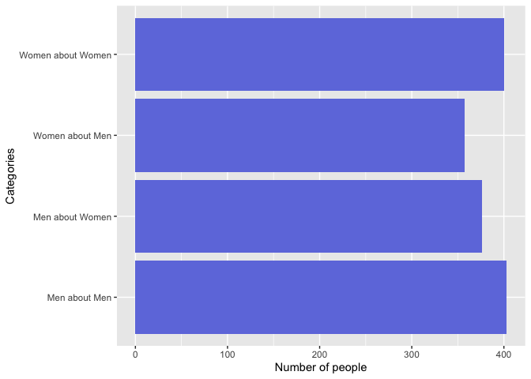
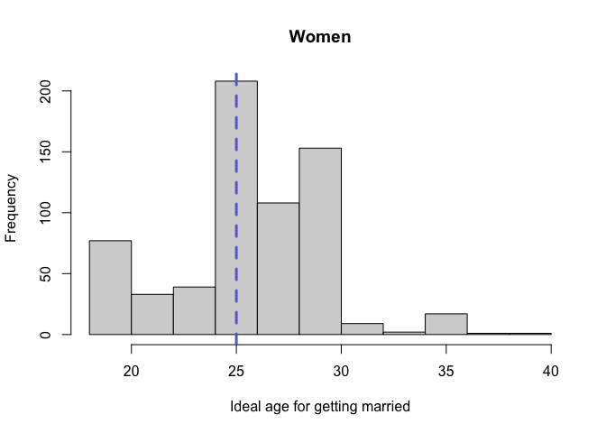
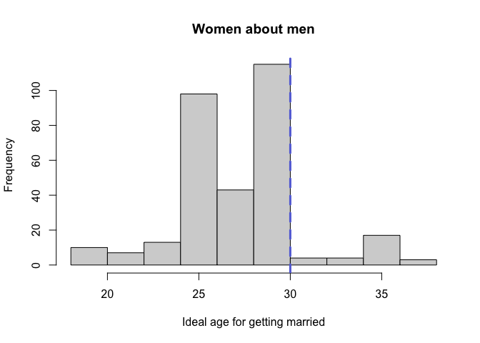

Exploring the factors influencing the perceived ideal timing of getting
married in Sweden, 2018
================
Anastasia Alekhina, Ekaterina Titova, Tatiana Ivanova
Last edited 02 July 2022

-   [Topic](#topic)
-   [Research question](#research-question)
-   [Theoretical background & Research
    Hypotheses](#theoretical-background--research-hypotheses)
    -   [Life course and history
        theories](#life-course-and-history-theories)
    -   [Evolutionary theory and theory of parental
        investment](#evolutionary-theory-and-theory-of-parental-investment)
        -   [Parenting and marriage](#parenting-and-marriage)
        -   [Cohabitation and marriage](#cohabitation-and-marriage)
        -   [Religiosity](#religiosity)
        -   [Trend toward desiring later
            marriage](#trend-toward-desiring-later-marriage)
-   [Central measures analysis](#central-measures-analysis)
    -   [Variables](#variables)
        -   [Gende](#gende)
        -   [Subgroup on the question (response about females or
            males)](#subgroup-on-the-question-response-about-females-or-males)
        -   [Income](#income)
        -   [Education](#education)
    -   [Analysis](#analysis)
        -   [Hypothesis 1](#hypothesis-1-1)
        -   [Hypothesis 2 and 3](#hypothesis-2-and-3)
        -   [Hypothesis 4](#hypothesis-4-1)
        -   [Hypothesis 5](#hypothesis-5-1)
    -   [Discussion and conclusions](#discussion-and-conclusions)
-   [Chi-square, T-test, ANOVA
    analysis](#chi-square-t-test-anova-analysis)
    -   [Variables](#variables-1)
        -   [Gender](#gender)
        -   [Subgroup on the question (response about females or
            males)](#subgroup-on-the-question-response-about-females-or-males-1)
        -   [Income](#income-1)
        -   [Education](#education-1)
    -   [Chi-square Test](#chi-square-test)
        -   [Education & Ideal age of
            marriage](#education--ideal-age-of-marriage)
        -   [Gender answer subgroup & Ideal age of
            marriage](#gender-answer-subgroup--ideal-age-of-marriage)
    -   [T-Test](#t-test)
        -   [Checking Assumptions](#checking-assumptions)
        -   [Applying T-test](#applying-t-test)
        -   [Non-parametic T-test](#non-parametic-t-test)
        -   [Effect size](#effect-size)
    -   [ANOVA](#anova)
        -   [Values descriptives](#values-descriptives)
        -   [Applying ANOVA test](#applying-anova-test)
        -   [Post hoc test](#post-hoc-test)
        -   [Effect size](#effect-size-1)
        -   [Non-parametric ANOVA test](#non-parametric-anova-test)
        -   [Effect size](#effect-size-2)
    -   [Discussion and conclusions](#discussion-and-conclusions-1)
-   [Correlation and regression
    analysis](#correlation-and-regression-analysis)
    -   [Variables](#variables-2)
    -   [Analysis](#analysis-1)
    -   [Correlation](#correlation)
        -   [Statistical hypotheses:](#statistical-hypotheses)
        -   [Normality assumption](#normality-assumption)
        -   [Correlation Matrix](#correlation-matrix)
    -   [Regression](#regression)
        -   [Plots of the variables](#plots-of-the-variables)
        -   [Model Comparison](#model-comparison)
        -   [Model Interpretation](#model-interpretation)
        -   [Regression Equation](#regression-equation)
    -   [Discussion](#discussion)
-   [Bibliography](#bibliography)


# Topic

Exploring the impact of attitudes, sociodemographic and socio-economic
factors on perceived ideal timing of getting married in Sweden

# Research question

1.  How are the household income, age, religion, attitudes toward ideal
    cohabitation and parenting timing, education of a person associated
    with the age one perceives as ideal to get married?

# Theoretical background & Research Hypotheses

### Life course and history theories

To explain how and why organisms, including humans, allocate energy,
time, and resources across their lifetime, evolutionary biologists and
behavioral ecologists developed **life history theory**. Energy devoted
to **somatic effort** (the growth and maintenance of one’s body and
mind, including the accumulation of knowledge, skills, and other types
of embodied capital) cannot simultaneously be devoted to **reproductive
effort** (intrasexual competition, courtship, gestation, birth, and
childcare) (Griskevicius et. al 2011) The particular nature of how and
when this tradeoff is resolved by a given organism constitutes that
organism’s life history strategy.

Existing literature on marital timing examines the influence of various
factors on the formation of the ideal age for marriage. Several studies
have shown that **education and income levels have a positive effect on
perceived ideal age to marry** and subsequently on becoming parents:
people with higher levels of SES marry and start families later. This
effect can be explained by **developmental life course theories**,
namely that young adults in their “emerging adulthood” (age 20 and
older), who are involved in educational and career processes, are less
interested in marriage and family life (Fuller, Frost, and Burr 2015).

## Evolutionary theory and theory of parental investment

According to **evolutionary theory** men and women develop different
gender-specific adaptive mechanisms, resulting from fact of facing
different mating and sexual behavior problems. Timing of
adulthood/maturity and reproduction-related behavior emerge as major
evolutionary mechanisms based on gender differences (Buss & Schmitt,
2011). Women and men thus tend to determine differently the optimal
maturity age for both their own and the opposite sex.

Trivers’s **theory of parental investment** explains some possible
mechanisms by which this determination of age might operate. According
to the theory, for gender with greater parental investment the
**resources of the opposite sex prove to be a powerful factor**, in
consequence of which women will tend to set a higher maturity and
reproductive-related age for men than men do for themselves. (Trivers,
1972; Pawlowski & Dunbar, 1999; Buss & Schmitt, 1993) Conversely, men,
being on the lower parental investment side, will be motivated by their
desire to date younger women because of their physical characteristics
and attractiveness as indicators of their reproductive value for
instance. Whereas women themselves will be inclined to indicate a lower
age for themselves, since they believe that it takes time to find a
worthy partner who can ensure the family.

### Parenting and marriage

Cherlin and colleagues created a study where they test three
propositions regarding mothers’ attitudes toward childbearing, marriage,
and divorce (Cherlin et. al, 2008). They suggested that **mothers’
attitudes and preferences in these three domains do not support the long
delay between childbearing and marriage** that has been noted in the
literature. Indeed, they found that 59 percent of the sample chose the
same 5-year age category for each of the 2 questions (“Best Age to
Marry” and “Best Age to Start Having Children”), which implies that a
majority of the mothers thinks the **best ages to start childbearing and
to marry are within 5 years of each other**. According to this article,
we can justify our proposition to test the influence of an ideal age for
getting pregnant.

### Cohabitation and marriage

Willoughby and Carroll in their study examined whether attitudes toward
cohabitation would be related to attitudes toward marriage (Willoughby
and Carroll, 2011). It was found that a later ideal age of **marriage
was associated with a stronger belief that cohabitation was
beneficial**. In addition, young adults who chose a younger ideal age of
marriage indicated that marriage was an important personal goal were
less likely to approve of cohabitation without marriage plans. Young
adults who value marriage and want to get married early may view
cohabitation as an **acceptable step toward a marriage relationship**,
but may be less likely to approve of cohabitation without marriage, and
see it as an alternative to being single or practicing serial
cohabitation. Based on this article, we can test whether the ideal age
of starting cohabitation with a partner will affect the ideal age of
marriage, as people view cohabitation as one of the important stages in
their lives before marriage.

### Religiosity

Fuller and Frost found the pervasive effect of religiosity on perceived
marital timing, namely their results show a **negative association
between religiosity with perceived ideal age to marry and ideal time to
marry**. Thus, they found that with increasing levels of religiosity,
respondents were most likely to report an earlier ideal age to marry and
an earlier ideal time to marry (Fuller, Frost, and Burr 2015).

### Trend toward desiring later marriage

According to Thornton and Young-DeMarco (2001), the trend toward
desiring later marriage continued from the mid-1970s through the 1990s.
Therefore, people who participated in the 70s in this research, now they
are older but with the belief of early marriage as desirable one.
Moreover, people who participated in the 90s in this research, they are
younger now than the previously mentioned people, but respondents from
the 90s share the idea of later marriage. Hence, we can test this claim
by looking at the age of respondents and their perception of ideal age
for getting married.

# Central measures analysis

#### Hypothesis 1

We hypothesize that mean, median and mode of perceived ideal age to get
married and to become a parent will be lower for women than for men from
evaluations by both genders. We expect to see a left-skewed distribution
in men’s and right-skewed one in women’s case.

#### Hypothesis 2

We hypothesize that mean, median and mode of men perceptions of ideal
age to get married and to become a parent for women will be lower than
that of women themselves.

#### Hypothesis 3

We hypothesize that mean, median and mode of women perceptions of ideal
age to get married and to become a parent for men will be higher than
that of men themselves.

#### Hypothesis 4

We hypothesize that people with higher educational level will choose
later age for marriage and becoming a parent more frequently.

#### Hypothesis 5

We hypothesize the correlation of income and the indicated ideal
marriage and becoming a parent timing will be characterized by a
positively sloping line.

## Variables

Prior to forming all the necessary categories and manipulating
variables, four lines were removed from the data, the values of which on
the main issues for us (the ideal age for marriage and the ideal age for
becoming a parent) were either missing or were irrelevant within the
family formation (such values as 2 for marriage, or 78 for having a
child).

``` r
ktn$iagmr <- as.numeric(as.character(ktn$iagmr))
ktn$iagpnt <- as.numeric(as.character(ktn$iagpnt))

# Ideal age for marriage
ktn$iagmr_cat[ktn$iagmr <="18"] <- "18 and earlier"
ktn$iagmr_cat[ktn$iagmr >= "19"& ktn$iagmr <="25"] <- "from 19 to 25"
ktn$iagmr_cat[ktn$iagmr >= "26"& ktn$iagmr <"30"] <- "from 26 to 30"
ktn$iagmr_cat[ktn$iagmr >= "31"] <- "over 31"

# Ideal age for becoming a parent 
ktn$iagpnt_cat[ktn$iagpnt <="18"] <- "18 and earlier"
ktn$iagpnt_cat[ktn$iagpnt >= "19"& ktn$iagpnt <="25"] <- "from 19 to 25"
ktn$iagpnt_cat[ktn$iagpnt >= "26"& ktn$iagpnt <"30"] <- "from 26 to 30"
ktn$iagpnt_cat[ktn$iagpnt >= "31"] <- "over 31"
```

Consequently, comparison of the reported ideal age of family formation
occurred according to the 4 main criterion of respondents:

### Gende

``` r
ggplot(ktn, aes(x =gndr)) + geom_bar(fill = "#6F7CDF")+
  labs(x="Gender", y="Number of people")
```

<!-- -->

The gender subgroups are evenly distributed into two categories,
amounting to 778 for men and 757 for women, respectively.

### Subgroup on the question (response about females or males)

``` r
#Gender subgroups datasets
f1 <- dplyr::filter(ktn, ktn$admge == "Group 1" & ktn$gndr == "Female")
m1 <- dplyr::filter(ktn, ktn$admge == "Group 1" & ktn$gndr == "Male")
f2 <- dplyr::filter(ktn, ktn$admge == "Group 2" & ktn$gndr == "Female")
m2 <- dplyr::filter(ktn, ktn$admge == "Group 2" & ktn$gndr == "Male")

f <- dplyr::filter(ktn, ktn$admge == "Group 1")
m <- dplyr::filter(ktn, ktn$admge == "Group 2")

#Gender subgroups 
ktn$admge_cat[ktn$admge == "Group 1" & ktn$gndr == "Female"] <- "Women about Women"
ktn$admge_cat[ktn$admge == "Group 1" & ktn$gndr == "Male"] <- "Men about Women"
ktn$admge_cat[ktn$admge == "Group 2" & ktn$gndr == "Female"] <- "Women about Men"
ktn$admge_cat[ktn$admge == "Group 2" & ktn$gndr == "Male"] <- "Men about Men"

ktn$admge_cat2[ktn$admge == "Group 1"] <- "About Women"
ktn$admge_cat2[ktn$admge == "Group 2"] <- "About Men"


ggplot(ktn, aes(x = admge_cat)) + geom_bar(fill = "#6F7CDF") + coord_flip() + scale_x_discrete(limits = rev(levels(ktn$admge_cat)))+
labs(x = "Categories", y = "Number of people")
```

<!-- -->

By considering which answer group the person is in (group 1 or group 2)
and comparing this to the gender of the person him/herself, we generated
4 subgroups, likewise evenly distributed, comprising about 380-400
people, with the category of women about men being the lowest with 357
people

### Income

``` r
# Income decile
ktn$hinctnta_cat[ktn$hinctnta == "J - 1st decile"] <- "1"
ktn$hinctnta_cat[ktn$hinctnta == "R - 2nd decile"] <- "2"
ktn$hinctnta_cat[ktn$hinctnta == "C - 3rd decile"] <- "3"
ktn$hinctnta_cat[ktn$hinctnta == "M - 4th decile"] <- "4"
ktn$hinctnta_cat[ktn$hinctnta == "F - 5th decile"] <- "5"
ktn$hinctnta_cat[ktn$hinctnta == "S - 6th decile"] <- "6"
ktn$hinctnta_cat[ktn$hinctnta == "K - 7th decile"] <- "7"
ktn$hinctnta_cat[ktn$hinctnta == "P - 8th decile"] <- "8"
ktn$hinctnta_cat[ktn$hinctnta == "D - 9th decile"] <- "9"
ktn$hinctnta_cat[ktn$hinctnta == "H - 10th decile"] <- "10"

ktn$hinctnta_cat_sorted <- factor(ktn$hinctnta_cat, ordered = TRUE,
levels = c("1", "2", "3", "4", "5", "6", "7", "8", "9", "10"))

ktn$hinctnta_cat <- as.numeric(ktn$hinctnta_cat)

ggplot(na.omit(ktn), aes(x = hinctnta_cat_sorted)) + geom_bar(fill = "#6F7CDF") +
labs(x = "Income decile", y = "Number of people")
```

<!-- -->

Respondents’ incomes are compiled using the decile income distribution
from the original database. Individuals are arranged in ascending order
of their income and divided into ten groups of equal size. Each income
decile contains 10 percent of the population; the higher the decile, the
higher the income level.

### Education

``` r
# education levels
ktn$eisced_cat[ktn$eisced == "ES-ISCED I , less than lower secondary"|
                 ktn$eisced == "ES-ISCED II, lower secondary"] <- "low education"
ktn$eisced_cat[ktn$eisced =="ES-ISCED IIIa, upper tier upper secondary" |
                 ktn$eisced =="ES-ISCED IIIb, lower tier upper secondary"|
                 ktn$eisced =="ES-ISCED IV, advanced vocational, sub-degree"] <- "middle education"
ktn$eisced_cat[ktn$eisced == "ES-ISCED V1, lower tertiary education, BA level" |
                 ktn$eisced == "ES-ISCED V2, higher tertiary education, >= MA level"] <- "high education"

ktn$eisced_cat_sorted <- factor(ktn$eisced_cat, ordered = TRUE,
levels = c("low education", "middle education", "high education"))

ggplot(na.omit(ktn), aes(x =eisced_cat_sorted)) + geom_bar(fill = "#6F7CDF")+
  labs(x="Level of education", y = "Number of people")
```

<!-- -->

The level of education has been distributed according to International
Standard Classification of Education, where ISCED levels 0-2 correspond
to low education, ISCED levels 3-4 correspond to middle education, ISCED
levels 5-8 correspond to higher education

Our data ended up having 1535 observations and 14 variables, 6 of which
were taken directly from the ESS9 database, while the other 8 were
created.

``` r
cls1 <- class(ktn$hinctnta_cat_sorted)
cls2 <- class(ktn$eisced_cat_sorted)

Table <- matrix(c("gndr", "iagpnt", "iagpnt_cat", "iagmr", "iagmr_cat",
"hinctnta", "hinctnta_cat", "hinctnta_cat_sorted", "eisced",
"eisced_cat", "eisced_cat_sorted", "admge", "admge_cat", "admge_cat2", 

"nominal", "ratio","ordinal", "ratio", "ordinal", "ordinal", "ratio",
"ordinal", "ordinal", "ordinal", "ordinal", "nominal", "nominal", "nominal",

"categorical", "continuous","categorical", "continuous", "categorical", "categorical", "continuous",
"categorical", "categorical","categorical","categorical","categorical","categorical","categorical",

class(ktn$gndr), class(ktn$iagpnt), class(ktn$iagpnt_cat), class(ktn$iagmr), class(ktn$iagmr_cat), class(ktn$hinctnta),
class(ktn$hinctnta_cat), class(cls1), class(ktn$eisced), class(ktn$eisced_cat), class(cls2),
class(ktn$admge), class(ktn$admge_cat), class(ktn$admge_cat2)), ncol = 4)

colnames(Table) <- c("Variables", "Measurement scale", "Variables’ types", "R data types")
Table <- as.data.frame(Table)
kbl(Table, align = "cccc") %>%
kable_styling(bootstrap_options = c("striped", "hover"))
```

<table class="table table-striped table-hover" style="margin-left: auto; margin-right: auto;">
<thead>
<tr>
<th style="text-align:center;">
Variables
</th>
<th style="text-align:center;">
Measurement scale
</th>
<th style="text-align:center;">
Variables’ types
</th>
<th style="text-align:center;">
R data types
</th>
</tr>
</thead>
<tbody>
<tr>
<td style="text-align:center;">
gndr
</td>
<td style="text-align:center;">
nominal
</td>
<td style="text-align:center;">
categorical
</td>
<td style="text-align:center;">
factor
</td>
</tr>
<tr>
<td style="text-align:center;">
iagpnt
</td>
<td style="text-align:center;">
ratio
</td>
<td style="text-align:center;">
continuous
</td>
<td style="text-align:center;">
numeric
</td>
</tr>
<tr>
<td style="text-align:center;">
iagpnt_cat
</td>
<td style="text-align:center;">
ordinal
</td>
<td style="text-align:center;">
categorical
</td>
<td style="text-align:center;">
character
</td>
</tr>
<tr>
<td style="text-align:center;">
iagmr
</td>
<td style="text-align:center;">
ratio
</td>
<td style="text-align:center;">
continuous
</td>
<td style="text-align:center;">
numeric
</td>
</tr>
<tr>
<td style="text-align:center;">
iagmr_cat
</td>
<td style="text-align:center;">
ordinal
</td>
<td style="text-align:center;">
categorical
</td>
<td style="text-align:center;">
character
</td>
</tr>
<tr>
<td style="text-align:center;">
hinctnta
</td>
<td style="text-align:center;">
ordinal
</td>
<td style="text-align:center;">
categorical
</td>
<td style="text-align:center;">
factor
</td>
</tr>
<tr>
<td style="text-align:center;">
hinctnta_cat
</td>
<td style="text-align:center;">
ratio
</td>
<td style="text-align:center;">
continuous
</td>
<td style="text-align:center;">
numeric
</td>
</tr>
<tr>
<td style="text-align:center;">
hinctnta_cat_sorted
</td>
<td style="text-align:center;">
ordinal
</td>
<td style="text-align:center;">
categorical
</td>
<td style="text-align:center;">
character
</td>
</tr>
<tr>
<td style="text-align:center;">
eisced
</td>
<td style="text-align:center;">
ordinal
</td>
<td style="text-align:center;">
categorical
</td>
<td style="text-align:center;">
factor
</td>
</tr>
<tr>
<td style="text-align:center;">
eisced_cat
</td>
<td style="text-align:center;">
ordinal
</td>
<td style="text-align:center;">
categorical
</td>
<td style="text-align:center;">
character
</td>
</tr>
<tr>
<td style="text-align:center;">
eisced_cat_sorted
</td>
<td style="text-align:center;">
ordinal
</td>
<td style="text-align:center;">
categorical
</td>
<td style="text-align:center;">
character
</td>
</tr>
<tr>
<td style="text-align:center;">
admge
</td>
<td style="text-align:center;">
nominal
</td>
<td style="text-align:center;">
categorical
</td>
<td style="text-align:center;">
factor
</td>
</tr>
<tr>
<td style="text-align:center;">
admge_cat
</td>
<td style="text-align:center;">
nominal
</td>
<td style="text-align:center;">
categorical
</td>
<td style="text-align:center;">
character
</td>
</tr>
<tr>
<td style="text-align:center;">
admge_cat2
</td>
<td style="text-align:center;">
nominal
</td>
<td style="text-align:center;">
categorical
</td>
<td style="text-align:center;">
character
</td>
</tr>
</tbody>
</table>

## Analysis

Analysis of the first three hypotheses regarding gender differentiation
is conducted through consideration of boxplots and histograms reflecting
gender/subcategories and the ideal age for marriage or parenthood in the
former with all mean and median values, and with mode values for the
ideal age per category in the latter.

### Hypothesis 1

#### Ideal age for getting married

``` r
ggplot(ktn, aes(x = admge_cat2, y = iagmr)) +
geom_boxplot()+
stat_summary(fun = "mean",colour = "#626FD9", size = 1)+
labs( x = "Gender", y = "Ideal age for getting married")
```

<!-- -->

``` r
ktn %>% 
  group_by(admge_cat2) %>% 
  summarise(mean = mean(iagmr, na.rm = T),
            median = median(iagmr, na.rm = T),
            mode = Mode(iagmr))
```

    ##       mean median mode
    ## 1 26.78023     27   25

The horizontal lines along the boxplot represent the median values of
the ideal age at marriage for each gender, while the circles reflect the
mean values. We observe that both mean and median values are lower for
women (around 25-26 years old) and higher for men (27-28 years old).

``` r
hist(f$iagmr,
main = "Women",
xlab="Ideal age for getting married")
abline(v = Mode(f$iagmr), col = '#626FD9', lwd = 3, lty = 2)
```

<!-- -->

``` r
hist(m$iagmr,
main = "Men",
xlab="Ideal age for getting married")
abline(v = Mode(m$iagmr), col = '#626FD9', lwd = 3, lty = 2)
```

<!-- -->

The vertical lines displayed in the histograms represent the mode values
observed for each gender. The graphs indicate the presence of a similar
trend as with the mean and median, since the mode value for men amounts
to 30 and the histogram appears left-skewed, while the women’s case
shows a slightly reverse distribution with a mode value of 25.

Thus, a comparison of central tendency measures and distributions
between men and women supports the first hypothesis, and both genders
tend to report a lower age of marriage for women, which is consistent
with the Todosijevic, Bojan, and Suzana Ignjatović (2021) findings.

#### Ideal age for becoming a parent

``` r
 ggplot(ktn, aes(x = admge_cat2, y = iagpnt)) +
geom_boxplot()+
stat_summary(fun = "mean",colour = "#6F7CDF", size = 1)+
labs(x = "Gender", y = "Ideal age for becoming a parent")
```

<!-- -->

``` r
ktn %>% 
  group_by(admge_cat2) %>% 
  summarise(mean = mean(iagpnt, na.rm = T),
            median = median(iagpnt, na.rm = T),
            mode = Mode(iagpnt))
```

    ##       mean median mode
    ## 1 27.38467     28   30

The horizontal lines along the boxplot represent the median values of
the ideal age at marriage for each gender, while the circles reflect the
mean values. The graph shows that respondents reported a lower
appropriate age of parenthood for women, approximately 26 years for
median and mean values ( though this age is higher than indicated within
marriage for women), and higher for men, about 27-28.

``` r
hist(f$iagpnt,
main = "Women",
xlab="Ideal age for becoming a parent")
abline(v = Mode(f$iagpnt), col = '#6F7CDF', lwd = 3, lty = 2)
```

<!-- -->

``` r
hist(m$iagpnt,
main = "Men",
xlab="Ideal age for becoming a parent")
abline(v = Mode(m$iagpnt), col = '#6F7CDF', lwd = 3, lty = 2)
```

<!-- -->

Mode values represent exactly the same situation as with marriage, with
both a lower value and a slightly more right-skewed distribution for
women, and a higher value with a left-skewing distortion for men.
However, it should be mentioned that in general both distributions look
a bit more symmetrical than with the ideal marriage age Accordingly, the
first hypothesis is also confirmed for the ideal age of becoming a
parent.

### Hypothesis 2 and 3

#### Ideal age for getting married

``` r
ggplot(ktn, aes(x = admge_cat, y = iagmr)) +
geom_boxplot()+
stat_summary(fun = "mean",colour = "#626FD9", size = 1)+
labs(x = "Category", y = "Ideal age for getting married")
```

<!-- -->

The horizontal lines along the boxplot represent the median values of
the ideal age at marriage for each of the four subcategories, whereas
the circles reflect the mean values. We can detect that men and women
reported approximately identical relevant and acceptable age of marriage
for women (25-26), meanwhile, regarding the acceptable male age of
marriage, men reported a lower age for themselves (about 26) than women
did for them (about 28)

``` r
hist(m1$iagmr,
main = "Men about women",
xlab="Ideal age for getting married")
abline(v = Mode(m1$iagmr), col = '#626FD9', lwd = 3, lty = 2)
```

<!-- -->

``` r
hist(f1$iagmr,
main = "Women about women",
xlab="Ideal age for getting married")
abline(v = Mode(f1$iagmr), col = '#626FD9', lwd = 3, lty = 2)
```

<!-- -->

``` r
hist(m2$iagmr,
main = "Men about men",
xlab="Ideal age for getting married")
abline(v = Mode(m2$iagmr), col = '#626FD9', lwd = 3, lty = 2) 
```

<!-- -->

``` r
hist(f2$iagmr,
main = "Women about men",
xlab="Ideal age for getting married")
abline(v = Mode(f2$iagmr), col = '#626FD9', lwd = 3, lty = 2)
```

<!-- -->

Within the context of mode values, exactly the same pattern can be
discerned, and the values most frequently marked by men and women for
women coincide(25), while females often marked a higher age for men (30)
than males for themselves (25). It can also be pointed out that women’s
answers concerning themselves take a more right-skewed shape, and those
about men are more left-skewed, yet both graphs of men’s answers appear
to be more or less symmetrical.

``` r
ktn %>% 
  group_by(admge_cat) %>% 
  summarise(mean = mean(iagmr, na.rm = T),
            median = median(iagmr, na.rm = T),
            mode = Mode(iagmr))
```

    ##       mean median mode
    ## 1 26.78023     27   25

Therefore, based on the central tendency measures comparison, we can
reject the second hypothesis, that men and women mark differently the
ideal age of marriage for women, although still confirming the third
hypothesis, stating that women report a higher age for men than they do
for themselves.

#### Ideal age for becoming a parent

``` r
ggplot(ktn, aes(x = admge_cat, y = iagpnt)) +
geom_boxplot()+
stat_summary(fun = "mean",colour = "#6F7CDF", size = 1)+
labs(x = "Category", y = "Ideal age for becoming a parent")
```

<!-- -->

The horizontal lines along the boxplot represent the median values of
the ideal age at marriage for each of the four subcategories, whereas
the circles reflect the mean values. It can be noted that within the
responses regarding the relative best age for women to become a parent,
women tend to indicate a slightly higher age for themselves than men
indicate for them within both the median and mean values. As for the
ideal age for men, men clearly mark a lower acceptable age for
themselves than women do indicate for them.

``` r
hist(m2$iagpnt,
main = "Men about men",
xlab="Ideal age for getting married")
abline(v = Mode(m2$iagpnt), col = '#6F7CDF', lwd = 3, lty = 2)
```

<!-- -->

``` r
hist(f2$iagpnt,
main = "Women about men",
xlab="Ideal age for becoming a parent")
abline(v = Mode(f2$iagpnt), col = '#6F7CDF', lwd = 3, lty = 2)
```

<!-- -->

``` r
hist(m1$iagpnt,
main = "Men about women",
xlab="Ideal age for becoming a parent")
abline(v = Mode(m1$iagpnt), col = '#6F7CDF', lwd = 3, lty = 2)
```

<!-- -->

``` r
hist(f1$iagpnt,
main = "Women about women",
xlab="Ideal age for becoming a parent")
abline(v = Mode(f1$iagpnt), col = '#6F7CDF', lwd = 3, lty = 2)
```

<!-- -->

Mode values showed no differences in the opinions of men and women
concerning one’s and the opposite sex, and, accordingly, both sexes most
often indicated the ideal age for having a child as 25 for a woman and
30 for a man. All of the histograms appear somewhat symmetrical.

``` r
ktn %>% 
  group_by(admge_cat) %>% 
  summarise(mean = mean(iagpnt, na.rm = T),
            median = median(iagpnt, na.rm = T),
            mode = Mode(iagpnt))
```

    ##       mean median mode
    ## 1 27.38467     28   30

Although the mode values did not show much difference, a comparison of
the median and mean values supports the hypotheses according to which
women report a higher age for men than they do for themselves, and that
men report a lower age for women than they do for themselves. This also
corresponds with the findings of Todosijevic, Bojan, and Suzana
Ignjatović (2021) in the framework of effects on reproduction related
behavior

### Hypothesis 4

#### Educational level and ideal age for family formation

``` r
plot_xtab(ktn$eisced_cat_sorted , ktn$iagmr_cat, margin = "row", bar.pos = "stack")+
labs(x = "Level of education", y = "Frequency")+
scale_fill_manual(values = c("#434659","#A7AEDF" , "#626FD9" , "#4B55A6"),
name = "Ideal age for getting married",
labels = c("18 and earlier", "from 19 to 25", "from 26 to 30", "over 31"))
```

<!-- -->

The stacked bar plot indicates the frequency of choosing the ideal age
for marriage in the 4 timing categories, depending on the level of
education. Hence, we can see that people with a low level of education
tend to indicate a young ideal age for getting married (19-25 years)
more frequently. The share of the people who think so is declining.
People with higher education less often choose this period of life as
ideal for creating a family. The proportion of people indicating 25-30
years of age increases with the level of education

``` r
ggplot(na.omit(ktn), aes(x = eisced_cat_sorted, y = iagmr)) +
  geom_boxplot() +
  stat_summary(fun = "mean",colour = "#626FD9", size = 1)+
  labs(x = "Level of education", y = "Ideal age for getting married")
```

<!-- -->

From the mean values (pink points on the graph) we can trace a similar
trend, with the high education group having the highest value of
perceiving the ideal age of marriage.

``` r
plot_xtab(ktn$eisced_cat_sorted, ktn$iagpnt_cat, margin = "row", bar.pos = "stack") +
  labs(x = "Level of education", y = "Frequency") +scale_fill_manual(values = c("#434659","#A7AEDF" , "#626FD9" , "#4B55A6"),
name = "Ideal age for becoming a parent",
labels = c("18 and earlier", "from 19 to 25", "from 26 to 30", "over 31"))
```

<!-- -->

The stacked bar plot indicates the frequency of choosing the ideal age
for becoming a parent in the 4 timing categories, depending on the level
of education. We can confirm the hypothesis that the ideal age for
becoming parents increases as the level of education increases: the
proportion of those with higher education most frequently chose the
ideal age for becoming parents from 26 to 30 and from 31+, while the
main periods for middle and low educational levels were from 19 to 25
years and below.

``` r
ggplot(na.omit(ktn), aes(x = eisced_cat_sorted, y = iagpnt)) +
  geom_boxplot() +
  stat_summary(fun = "mean",colour = "#626FD9", size = 1)+
  labs(x = "Level of education", y = "Ideal age for becoming a parent")
```

<!-- -->

Again, from the mean values (pink points on the graph) we can trace a
similar trend, with the high education group having the highest value of
perceiving the ideal age of becoming a parent.

### Hypothesis 5

#### Income and ideal age for family formation

``` r
ggplot(ktn, aes(x = hinctnta_cat, y = iagmr )) +
  geom_point() +
  geom_smooth(method="lm")+
  labs(x = "Income decile", y = "Ideal age for getting married")
```

<!-- -->

The scatter plot represents individuals’ responses on the ideal time of
entering a marriage, depending on their income background (in deciles).
According to the results, we see that the level of income has negligible
influence on determining the ideal age for marriage, nethertheless we
observe an upward trend

``` r
ggplot(ktn, aes(x = hinctnta_cat, y = iagpnt )) +
  geom_point() +
  geom_smooth(method="lm")+ 
 labs(x = "Income decile", y = "Ideal age for becoming a parent")
```

<!-- -->

The scatter plot represents individuals’ responses on the ideal time of
becoming a parent, depending on their income background (in deciles).
According to the results, we see that the level of income has a similar
minor influence on determining the ideal age for becoming a parent as
well, however the slope is generally positive

## Discussion and conclusions

The purpose of this study was to examine how demographic (gender) and
socioeconomic (income and education) factors impact the perceived ideal
timing of family formation in individuals.

Under the influence of gender on the perceived age of marriage, we were
able to confirm the first and third hypotheses for the mean, median and
mode values, suggesting that women are generally ascribed a lower ideal
marital age, as substantiated by evolutionary theory, and that women
estimate the ideal age of marriage for men to be higher than men for
themselves, as they are concerned about their spouse being able to
support the family. The second hypothesis was rejected, as women and men
estimated the ideal age of marriage entry for females similarly.

Considering the effect of gender on the perceived ideal age of becoming
a parent, all three hypotheses were confirmed within the median and
average values. Regarding the effect of income and education on the
perceived ideal timing of family formation, we can say that people with
higher education prefer a later timing, thus confirming our 4th
hypothesis, but we did not find a strong relationship between income and
timing for our 5th hypothesis, but a positive trend does occur.

# Chi-square, T-test, ANOVA analysis

#### Hypothesis 1

We hypothesize that there would be statistically significant association
between respondent’s education level and perceived ideal age for getting
married, that is, there will be a greater proportion of respondents with
higher level of education (compared to lower one) who will mark a higher
ideal age for getting married.

#### Hypothesis 2

We hypothesize that there would be a statistically significant
association between perceived ideal age to get married and gender answer
group , such that a greater proportion of men (compared to women) would
indicate a lower ideal age to get married for women, and conversely a
greater proportion of women (compared to men) will indicate a higher
ideal age to get married for men.

#### Hypothesis 3

We hypothesize that means of perceived ideal age to get married will be
lower for women than for men from evaluations by both genders.

#### Hypothesis 4

We hypothesize that there will be a difference in means of perceived
ideal age for getting married, according to respondents’ income level,
that is, respondents with higher income, on average, will mark higher
age for getting married, than respondents with lower level of income.

## Variables

Prior to forming all the necessary categories and manipulating
variables, four lines were removed from the data, the values of which on
the main issues for us (the ideal age for marriage ) were either missing
or were irrelevant within the family formation (such values as 2 for
marriage).

``` r
ktn$iagmr <- as.numeric(as.character(ktn$iagmr))

# Ideal age for marriage
ktn$iagmr_cat[ktn$iagmr <="18"] <- "18 and earlier"
ktn$iagmr_cat[ktn$iagmr >= "19"& ktn$iagmr <="25"] <- "from 19 to 25"

ktn$iagmr_cat[ktn$iagmr >= "26"& ktn$iagmr <"30"] <- "from 26 to 30"
ktn$iagmr_cat[ktn$iagmr >= "31"] <- "over 31"
```

Consequently, comparison of the reported ideal age of getting married
occurred according to the 4 main criterion of respondents:

### Gender

The gender subgroups are evenly distributed into two categories,
amounting to 778 for men and 757 for women, respectively.

### Subgroup on the question (response about females or males)

``` r
#Gender subgroups datasets
f1 <- dplyr::filter(ktn, ktn$admge == "Group 1" & ktn$gndr == "Female")
m1 <- dplyr::filter(ktn, ktn$admge == "Group 1" & ktn$gndr == "Male")
f2 <- dplyr::filter(ktn, ktn$admge == "Group 2" & ktn$gndr == "Female")
m2 <- dplyr::filter(ktn, ktn$admge == "Group 2" & ktn$gndr == "Male")

f <- dplyr::filter(ktn, ktn$admge == "Group 1")
m <- dplyr::filter(ktn, ktn$admge == "Group 2")

#Gender subgroups 
ktn$admge_cat[ktn$admge == "Group 1" & ktn$gndr == "Female"] <- "Women about Women"
ktn$admge_cat[ktn$admge == "Group 1" & ktn$gndr == "Male"] <- "Men about Women"
ktn$admge_cat[ktn$admge == "Group 2" & ktn$gndr == "Female"] <- "Women about Men"
ktn$admge_cat[ktn$admge == "Group 2" & ktn$gndr == "Male"] <- "Men about Men"

ktn$admge_cat2[ktn$admge == "Group 1"] <- "About Women"
ktn$admge_cat2[ktn$admge == "Group 2"] <- "About Men"
```

By considering which gender answer subgroups the person is in (group 1
or group 2) and comparing this to the gender of the person him/herself,
we generated 4 subgroups, likewise evenly distributed, comprising about
380-400 people, with the category of women about men being the lowest
with 357 people

### Income

``` r
# Income decile
ktn$hinctnta_cat[ktn$hinctnta == "J - 1st decile"] <- "1"
ktn$hinctnta_cat[ktn$hinctnta == "R - 2nd decile"] <- "2"
ktn$hinctnta_cat[ktn$hinctnta == "C - 3rd decile"] <- "3"
ktn$hinctnta_cat[ktn$hinctnta == "M - 4th decile"] <- "4"
ktn$hinctnta_cat[ktn$hinctnta == "F - 5th decile"] <- "5"
ktn$hinctnta_cat[ktn$hinctnta == "S - 6th decile"] <- "6"
ktn$hinctnta_cat[ktn$hinctnta == "K - 7th decile"] <- "7"
ktn$hinctnta_cat[ktn$hinctnta == "P - 8th decile"] <- "8"
ktn$hinctnta_cat[ktn$hinctnta == "D - 9th decile"] <- "9"
ktn$hinctnta_cat[ktn$hinctnta == "H - 10th decile"] <- "10"


ktn$hinctnta_cat <- as.numeric(ktn$hinctnta_cat)

ktn$hinctnta_cat_1[ktn$hinctnta_cat == "1" | ktn$hinctnta_cat == "2" ] <- "low income" 
ktn$hinctnta_cat_1[ktn$hinctnta_cat == "3" | ktn$hinctnta_cat == "4" | ktn$hinctnta_cat == "5" ] <- "below average" 
ktn$hinctnta_cat_1[ktn$hinctnta_cat == "6" | ktn$hinctnta_cat == "7" | ktn$hinctnta_cat == "8"] <- "above average" 
ktn$hinctnta_cat_1[ktn$hinctnta_cat == "9" | ktn$hinctnta_cat == "10"] <- "high income"

ktn$hinctnta_cat_1_sorted <- factor(ktn$hinctnta_cat_1, ordered = TRUE, levels = c("low income" , "below average", "above average", "high income"))


ktn$hinctnta_cat_1 <- factor(ktn$hinctnta_cat_1)
```

Respondents’ incomes are compiled using the decile income distribution
from the original database. Individuals are arranged in ascending order
of their income and divided into ten groups of equal size. Each income
decile contains 10 percent of the population; the higher the decile, the
higher the income level.

### Education

``` r
# education levels
ktn$eisced_cat[ktn$eisced == "ES-ISCED I , less than lower secondary"|
                 ktn$eisced == "ES-ISCED II, lower secondary"] <- "low education"
ktn$eisced_cat[ktn$eisced =="ES-ISCED IIIa, upper tier upper secondary" |
                 ktn$eisced =="ES-ISCED IIIb, lower tier upper secondary"|
                 ktn$eisced =="ES-ISCED IV, advanced vocational, sub-degree"] <- "middle education"
ktn$eisced_cat[ktn$eisced == "ES-ISCED V1, lower tertiary education, BA level" |
                 ktn$eisced == "ES-ISCED V2, higher tertiary education, >= MA level"] <- "high education"

ktn$eisced_cat_sorted <- factor(ktn$eisced_cat, ordered = TRUE,
levels = c("low education", "middle education", "high education"))
```

The level of education has been distributed according to International
Standard Classification of Education, where ISCED levels 0-2 correspond
to low education, ISCED levels 3-4 correspond to middle education, ISCED
levels 5-8 correspond to higher education

Our data ended up having 1535 observations and 14 variables, 6 of which
were taken directly from the ESS9 database, while the other 8 were
created.

``` r
cls1 <- class(ktn$hinctnta_cat_sorted)
cls2 <- class(ktn$eisced_cat_sorted)
Table <- matrix(c("gndr", "iagmr", "iagmr_cat",
"hinctnta", "hinctnta_cat", "hinctnta_cat_sorted", "hinctnta_cat_1", "eisced",
"eisced_cat", "eisced_cat_sorted", "admge", "admge_cat", "admge_cat2", 

"nominal", "ratio", "ordinal", "ordinal", "ratio",
"ordinal", "ordinal",  "ordinal", "ordinal", "ordinal", "nominal", "nominal", "nominal",

"categorical",  "continuous", "categorical", "categorical", "continuous",
"categorical", 'catgorical', "categorical","categorical","categorical","categorical","categorical","categorical",

class(ktn$gndr), class(ktn$iagmr), class(ktn$iagmr_cat), class(ktn$hinctnta),
class(ktn$hinctnta_cat), class(cls1), class(ktn$hinctnta_cat_1), class(ktn$eisced), class(ktn$eisced_cat), class(cls2),
class(ktn$admge), class(ktn$admge_cat), class(ktn$admge_cat2)), ncol = 4)

colnames(Table) <- c("Variables", "Measurement scale", "Variables’ types", "R data types")
Table <- as.data.frame(Table)
kbl(Table, align = "cccc") %>%
kable_styling(bootstrap_options = c("striped", "hover"))
```

<table class="table table-striped table-hover" style="margin-left: auto; margin-right: auto;">
<thead>
<tr>
<th style="text-align:center;">
Variables
</th>
<th style="text-align:center;">
Measurement scale
</th>
<th style="text-align:center;">
Variables’ types
</th>
<th style="text-align:center;">
R data types
</th>
</tr>
</thead>
<tbody>
<tr>
<td style="text-align:center;">
gndr
</td>
<td style="text-align:center;">
nominal
</td>
<td style="text-align:center;">
categorical
</td>
<td style="text-align:center;">
factor
</td>
</tr>
<tr>
<td style="text-align:center;">
iagmr
</td>
<td style="text-align:center;">
ratio
</td>
<td style="text-align:center;">
continuous
</td>
<td style="text-align:center;">
numeric
</td>
</tr>
<tr>
<td style="text-align:center;">
iagmr_cat
</td>
<td style="text-align:center;">
ordinal
</td>
<td style="text-align:center;">
categorical
</td>
<td style="text-align:center;">
character
</td>
</tr>
<tr>
<td style="text-align:center;">
hinctnta
</td>
<td style="text-align:center;">
ordinal
</td>
<td style="text-align:center;">
categorical
</td>
<td style="text-align:center;">
factor
</td>
</tr>
<tr>
<td style="text-align:center;">
hinctnta_cat
</td>
<td style="text-align:center;">
ratio
</td>
<td style="text-align:center;">
continuous
</td>
<td style="text-align:center;">
numeric
</td>
</tr>
<tr>
<td style="text-align:center;">
hinctnta_cat_sorted
</td>
<td style="text-align:center;">
ordinal
</td>
<td style="text-align:center;">
categorical
</td>
<td style="text-align:center;">
character
</td>
</tr>
<tr>
<td style="text-align:center;">
hinctnta_cat_1
</td>
<td style="text-align:center;">
ordinal
</td>
<td style="text-align:center;">
catgorical
</td>
<td style="text-align:center;">
factor
</td>
</tr>
<tr>
<td style="text-align:center;">
eisced
</td>
<td style="text-align:center;">
ordinal
</td>
<td style="text-align:center;">
categorical
</td>
<td style="text-align:center;">
factor
</td>
</tr>
<tr>
<td style="text-align:center;">
eisced_cat
</td>
<td style="text-align:center;">
ordinal
</td>
<td style="text-align:center;">
categorical
</td>
<td style="text-align:center;">
character
</td>
</tr>
<tr>
<td style="text-align:center;">
eisced_cat_sorted
</td>
<td style="text-align:center;">
ordinal
</td>
<td style="text-align:center;">
categorical
</td>
<td style="text-align:center;">
character
</td>
</tr>
<tr>
<td style="text-align:center;">
admge
</td>
<td style="text-align:center;">
nominal
</td>
<td style="text-align:center;">
categorical
</td>
<td style="text-align:center;">
factor
</td>
</tr>
<tr>
<td style="text-align:center;">
admge_cat
</td>
<td style="text-align:center;">
nominal
</td>
<td style="text-align:center;">
categorical
</td>
<td style="text-align:center;">
character
</td>
</tr>
<tr>
<td style="text-align:center;">
admge_cat2
</td>
<td style="text-align:center;">
nominal
</td>
<td style="text-align:center;">
categorical
</td>
<td style="text-align:center;">
character
</td>
</tr>
</tbody>
</table>

## Chi-square Test

### Education & Ideal age of marriage

We want to explore the relationship between two categorical variables of
education level (eisced_cat_sorted) and ideal age of marriage
(iagmr_cat).

``` r
plot_xtab(ktn$eisced_cat_sorted , ktn$iagmr_cat, margin = "row", bar.pos = "stack")+
labs(x = "Level of education", y = "Frequency")+
scale_fill_manual(values = c("#434659","#A7AEDF" , "#626FD9" , "#4B55A6"),
name = "Ideal age for getting married",
labels = c("18 and earlier", "from 19 to 25", "from 26 to 30", "over 31"))
```

<!-- -->

#### Contingency table

``` r
table(ktn$iagmr_cat, ktn$eisced_cat_sorted)
```

    ##                 
    ##                  low education middle education high education
    ##   18 and earlier             4               23              9
    ##   from 19 to 25            130              309            137
    ##   from 26 to 30             38              113             83
    ##   over 31                    6               47             30

#### Null and Alternative Hypotheses

**Null hypothesis (H0)**: the variables of ideal age of marriage and
level of education are independent

**Alternative hypothesis (H1)**: the variables of ideal age of marriage
and level of education are dependent

``` r
# Chi-square Test
chisq.test(ktn$iagmr_cat, ktn$eisced_cat_sorted)
```

    ## 
    ##  Pearson's Chi-squared test
    ## 
    ## data:  ktn$iagmr_cat and ktn$eisced_cat_sorted
    ## X-squared = 24.398, df = 6, p-value = 0.0004412

``` r
s <- chisq.test(ktn$iagmr_cat, ktn$eisced_cat_sorted)
```

There is a statistically significant association between level of
education and ideal age of marriage indicated by respondent,
X-squared(6) = 24.398, p-value = 0.0004412, so the variables are not
independently distributed. It means that the level of education of the
respondent is related to the perceived ideal age to get married.

Now we are going to check the chi-square test assumption on having at
least 5 expected observations per cell and then inspect and visualize
the standardized residuals to understand which categories create the
largest differences between the model and the data.

``` r
s$expected
```

    ##                 ktn$eisced_cat_sorted
    ## ktn$iagmr_cat    low education middle education high education
    ##   18 and earlier       6.89774         19.06566       10.03660
    ##   from 19 to 25      110.36383        305.05059      160.58558
    ##   from 26 to 30       44.83531        123.92680       65.23789
    ##   over 31             15.90312         43.95694       23.13994

There are no expected frequencies below 5, so the assumption is met (the
test is reliable).

#### Analyzing Standardized residuals

``` r
#STANDARDIZED RESIDUALS

col<- colorRampPalette(c("deeppink3", 'gainsboro',"darkseagreen3"))(20)
corrplot(s$residuals, is.cor = FALSE, col = col)
```

<!-- -->

``` r
s$stdres
```

    ##                 ktn$eisced_cat_sorted
    ## ktn$iagmr_cat    low education middle education high education
    ##   18 and earlier    -1.2516300        1.3399697     -0.3929795
    ##   from 19 to 25      3.3724983        0.5348521     -3.5553649
    ##   from 26 to 30     -1.3126571       -1.6546002      2.9938532
    ##   over 31           -2.8942863        0.7012715      1.7597066

We can conclude that respondents with low education are more likely to
indicate period of 19 to 25 years for ideal age to get married, and less
likely to state the period over 31 than the model would expect. As well,
there are less respondents with high education that have chosen the
period of 19 to 25 years for ideal marriage age, and much more people
who stated the period from 26 to 30 than we would expect.

Finally, we would like to plot the association between variables and
inspect how strong it is using the Cramér’s V measure.

``` r
#EFFECT SIZE
assocstats(table(ktn$eisced_cat_sorted , ktn$iagmr_cat))
```

    ##                     X^2 df   P(> X^2)
    ## Likelihood Ratio 26.024  6 0.00022034
    ## Pearson          24.398  6 0.00044115
    ## 
    ## Phi-Coefficient   : NA 
    ## Contingency Coeff.: 0.16 
    ## Cramer's V        : 0.115

``` r
# PLOTS
ggbarstats(
  data = ktn,
  x = iagmr_cat,
  y = eisced_cat_sorted,
  legend.title = 'Ideal age for getting married'
) +
  labs(x = 'Level of education') + 
 scale_fill_manual(values = c("#E2ADF2","#A7AEDF" , "#AB81CD", "#222A68" ),
labels = c("18 and earlier", "from 19 to 25", "from 26 to 30", "over 31"))
```

<!-- -->

Cramer’s V of 0.115 at degrees of freedom = 6 indicates that although
the result is statistically significant, the fields are only weakly
associated.

Concluding, we can confirm our first research hypothesis, and state that
there is an association, though it is small, between variables of
education level and ideal age for marriage and residuals verify that
more respondents from high education group are indicating higher values
of perceived ideal age of getting married, whereas more of those from
lower education one have chosen lower age as ideal.

### Gender answer subgroup & Ideal age of marriage

We want to explore the relationship between two categorical variables of
gender answer subgroup (admge_cat) and ideal age of marriage
(iagmr_cat).

``` r
plot_xtab(ktn$admge_cat , ktn$iagmr_cat, margin = "row", bar.pos = "stack")+
labs(x = "Level of education", y = "Frequency")+
scale_fill_manual(values = c("#434659","#A7AEDF" , "#626FD9" , "#4B55A6"),
name = "Ideal age for getting married",
labels = c("18 and earlier", "from 19 to 25", "from 26 to 30", "over 31"))
```

<!-- -->

#### Contingency table

``` r
table(ktn$iagmr_cat, ktn$admge_cat)
```

    ##                 
    ##                  Men about Men Men about Women Women about Men
    ##   18 and earlier            11              18               1
    ##   from 19 to 25            150             146             122
    ##   from 26 to 30             55              60              53
    ##   over 31                   26              15              28
    ##                 
    ##                  Women about Women
    ##   18 and earlier                 8
    ##   from 19 to 25                168
    ##   from 26 to 30                 73
    ##   over 31                       15

#### Null and Alternative Hypotheses

**Null hypothesis (H0)**: the variables of ideal age of marriage and
gender answer subgroup are independent

**Alternative hypothesis (H1)**: the variables of ideal age of marriage
and gender answer subgroup are dependent

``` r
chisq.test(ktn$iagmr_cat, ktn$admge_cat)
```

    ## 
    ##  Pearson's Chi-squared test
    ## 
    ## data:  ktn$iagmr_cat and ktn$admge_cat
    ## X-squared = 27.3, df = 9, p-value = 0.001248

``` r
k <- chisq.test(ktn$iagmr_cat, ktn$admge_cat)
```

There is a statistically significant association between gender answer
subgroup and ideal age of marriage indicated by respondent, X-squared(9)
= 27.3, p-value = 0.001248, so the variables are not independently
distributed. It means that gender answer subgroup(about men or about
women) of the respondent is related to the perceived ideal age to get
married .

Now we are going to check the chi-square test assumption on having at
least 5 expected observations per cell and then inspect and visualize
the standardized residuals to understand which categories create the
largest differences between the model and the data.

``` r
k$expected
```

    ##                 ktn$admge_cat
    ## ktn$iagmr_cat    Men about Men Men about Women Women about Men
    ##   18 and earlier       9.69020        9.570074        8.168599
    ##   from 19 to 25      149.43309      147.580611      125.968388
    ##   from 26 to 30       61.45627       60.694415       51.806112
    ##   over 31             21.42044       21.154900       18.056902
    ##                 ktn$admge_cat
    ## ktn$iagmr_cat    Women about Women
    ##   18 and earlier          10.57113
    ##   from 19 to 25          163.01791
    ##   from 26 to 30           67.04320
    ##   over 31                 23.36776

There are no expected frequencies below 5, so the assumption is met (the
test is reliable).

#### Analyzing Standardized residuals

``` r
col<- colorRampPalette(c("deeppink3", 'gainsboro',"darkseagreen3"))(20)
corrplot(k$residuals, is.cor = FALSE, col = col)
```

<!-- -->

``` r
k$stdres
```

    ##                 ktn$admge_cat
    ## ktn$iagmr_cat    Men about Men Men about Women Women about Men
    ##   18 and earlier    0.49754900      3.21546644     -2.88927826
    ##   from 19 to 25     0.08687521     -0.24321711     -0.64523524
    ##   from 26 to 30    -1.10468497     -0.11930681      0.21674278
    ##   over 31           1.20076423     -1.62048304      2.76617799
    ##                 ktn$admge_cat
    ## ktn$iagmr_cat    Women about Women
    ##   18 and earlier       -0.95000239
    ##   from 19 to 25         0.74261070
    ##   from 26 to 30         0.99137895
    ##   over 31              -2.13409307

We can conclude that male respondents giving answer about women are more
likely to indicate the period of 18 and earlier as ideal age to get
married for them than the model would expect. As well, there are much
less female respondents giving answer about men that have chosen the
period of 18 and earlier as ideal marriage age for them, and much more
of those who have chosen the period of over 31, than we would expect. In
addition, female respondents are less likely to state the period of over
31 years as ideal marriage age for themselves.

Finally, we would like to plot the association between variables and
inspect how strong it is using the Cramér’s V measure.

``` r
#EFFECT SIZE
assocstats(table(ktn$admge_cat , ktn$iagmr_cat))
```

    ##                     X^2 df   P(> X^2)
    ## Likelihood Ratio 29.448  9 0.00054434
    ## Pearson          27.300  9 0.00124761
    ## 
    ## Phi-Coefficient   : NA 
    ## Contingency Coeff.: 0.167 
    ## Cramer's V        : 0.098

``` r
# PLOTS
ggbarstats(
  data = ktn,
  x = iagmr_cat,
  y = admge_cat,
  legend.title = 'Ideal age for getting married'
) +
  labs(x = 'Gender answer subgroup') + 
  scale_fill_manual(values = c("#E2ADF2","#A7AEDF" , "#AB81CD", "#222A68" ))
```

<!-- -->

Cramer’s V of 0.098 at degrees of freedom = 9 indicates that although
the result is statistically significant, the fields are very weakly
associated.

Thus, we can as well confirm our second research hypothesis, and
conclude that there is an association, though it is weak, between
variables of gender answer subgroup and ideal age for marriage and
residuals verify that more male respondents are indicating lower values
of perceived ideal age of getting married for women, whereas more female
respondents have chosen higher ideal age for men.

## T-Test

#### Answer group & Ideal age of marriage

We want to explore the relationship between the categorical variable of
gender answer subgroup (admge_cat2) and a continuous variable of ideal
marriage age(iagmr).

``` r
ggplot(ktn, aes(x = admge_cat2)) + geom_bar(fill = "#A7AEDF") + coord_flip() + scale_x_discrete(limits = rev(levels(ktn$admge_cat)))+
labs(x = "Categories", y = "Number of people")
```

<!-- -->

``` r
ggplot(ktn, aes(iagmr)) + 
  geom_histogram(color = "#ffffff" , fill = "#A7AEDF", 
                 bins = 15)+
  labs(x = 'Ideal age for getting married')
```

<!-- -->

**Null hypothesis (H0)**: there is no difference between mean ideal age
of marriage for gender answer subgroups (about men or about women)

**Alternative hypothesis (H1)**: mean ideal age of marriage for gender
answer subgroups (about men or about women) are different

### Checking Assumptions

#### Normality of the variable distribution

``` r
#NORAMILTY
# HISTOGRAM
mu <- ddply(ktn, "admge_cat2", summarise, grp.mean = mean(iagmr, na.rm = T)) # calculate mean by group 

ggplot(ktn,aes(x = iagmr, color = admge_cat2, fill = admge_cat2)) +geom_density(alpha = 0.5) +
  labs(title = "Answers by gender", x = "Ideal age for marriage", y = "Density") +theme_classic()
```

<!-- -->

``` r
# QQ-plot
par(mfrow =c(1,2))
qqnorm(f$iagmr);qqline(f$iagmr, col = 2)
qqnorm(m$iagmr);qqline(m$iagmr, col = 2)
```

<!-- -->

According to histogram and qq-plot, we observe a non-normal
distribution. However, the number of observations is large (n\>100), and
the t-test is highly robust to non-normality, so we can proceed with the
t-test and additionally compare received results with a non-parametric
test.

#### Homogenity of variances

To check the homogenity of variances assumption we will proceed with the
Levene’s test as it is less sensittive to departures from normality.

``` r
# HOMOGENITY OF VARIANCES
leveneTest(ktn$iagmr ~ ktn$admge_cat2)
```

    ## Levene's Test for Homogeneity of Variance (center = median)
    ##         Df F value Pr(>F)
    ## group    1  0.2035  0.652
    ##       1313

Levene’s test showed big p-value (\>0,05), so we cannot reject the null
hypothesis. Thus, the variances are equal.

### Applying T-test

The distributions of the DV are not normal but the sample is large
enough (n \> 100), so non-normality can be effectively ignored.
Variances are equal, so the classic T-test can be applied.

``` r
t.test(ktn$iagmr ~ ktn$admge_cat2)
```

    ## 
    ##  Welch Two Sample t-test
    ## 
    ## data:  ktn$iagmr by ktn$admge_cat2
    ## t = 6.2049, df = 1311.9, p-value = 7.324e-10
    ## alternative hypothesis: true difference in means between group About Men and group About Women is not equal to 0
    ## 95 percent confidence interval:
    ##  0.8916952 1.7162277
    ## sample estimates:
    ##   mean in group About Men mean in group About Women 
    ##                  27.42279                  26.11883

We can conclude that:

1.  On average, the ideal age of marriage for men is 27.4 and for women
    26.1
2.  The t-statistic t(1312) = 6.2049 (p-value \< 0.001), which means
    that the observed difference in means is statistically significant
    across the two subgroups, answering about different genders (higher
    in group “about men”).

### Non-parametic T-test

Now, as our distributions are not normal, we would also like to do a
non-parametric test in order to compare the results.

``` r
wilcox.test(iagmr ~ admge_cat2, data = ktn)
```

    ## 
    ##  Wilcoxon rank sum test with continuity correction
    ## 
    ## data:  iagmr by admge_cat2
    ## W = 255592, p-value = 3.995e-09
    ## alternative hypothesis: true location shift is not equal to 0

The Wilcoxon rank sum W equals 255593 at p \< 0.001, which means that
two subgroups, answering about different genders, perceive the ideal age
for getting married differently and this difference is statistically
significant.

### Effect size

Finally, we would like to explore the effect size - how large the
observed difference actually is.

``` r
cohen.d(ktn$iagmr ~ ktn$admge_cat2, na.rm = T)
```

    ## 
    ## Cohen's d
    ## 
    ## d estimate: 0.3422562 (small)
    ## 95 percent confidence interval:
    ##     lower     upper 
    ## 0.2332586 0.4512538

``` r
rstatix::wilcox_effsize(iagmr ~ admge_cat2, data = ktn, na.rm = T) # for non-parametric
```

    ## # A tibble: 1 × 7
    ##   .y.   group1    group2      effsize    n1    n2 magnitude
    ## * <chr> <chr>     <chr>         <dbl> <int> <int> <ord>    
    ## 1 iagmr About Men About Women   0.162   760   776 small

With a Cohen’s d of 0.34, 63.3% of the group answering about men will be
above the mean of the group answering about women (Cohen’s U3), 86.5% of
the two groups will overlap, and there is a 59.5% chance that a person
picked at random from the group answering about men will have a higher
score than a person picked at random from the group answering about
women (probability of superiority). Moreover, in order to have one more
favorable outcome in the group answering about men compared to the group
answering about women, we need to treat 9.3 people on average. This
means that if there are 100 people in each group, and we assume that 20
people have favorable outcomes in the group answering about women, then
20 + 10.8 people in the group answering about men will have favorable
outcomes.

The effect size of the Mann-Whitney-Wilcoxon test is 0,16 (small), even
though it is statistically significant.

Concluding, we can confirm our third research hypothesis and there is a
difference between the ideal age for getting married between the
answering groups, even though it is small, and both genders indicate a
higher ideal marriage age for men and a lower one for women.

## ANOVA

We want to explore the relationship between the categorical variable of
income levels (hinctnta_cat_1) and a continuous variable of ideal age of
marriage (iagmr), to assess whether the mean of the ideal age outcome
variable is different across 4 groups.

``` r
# Ideal age to get married
ggplot(ktn, aes(x = iagmr)) + 
geom_density( 
color="#4B55A6", 
fill="#A7AEDF",)+
  labs(x = 'Ideal age for getting married')
```

<!-- -->

``` r
# Income category
par(mar = c(5, 10, 2, 2))
barplot(table(ktn$hinctnta_cat_1_sorted)/nrow(ktn)*100, las = 2, horiz = T, col = "#A7AEDF", xlim = c(0, 60))
```

<!-- -->

``` r
# Boxplot 
ggboxplot(ktn, x = 'hinctnta_cat_1', y = 'iagmr', 
          color = 'hinctnta_cat_1', palette = c("#E2ADF2","#A7AEDF" , "#AB81CD", "#222A68" ),
          order = c("low income", "below average", "above average", "high income"),
          ylab = "Ideal age to get married", xlab = "Income group", legend.title = 'Income group')
```

<!-- -->

**Null hypothesis (H0)**: The Mean Ideal ages for getting married
indicated by all groups are the same

**Alternative hypothesis (H1)**: At least one sample Mean Ideal age for
getting married is different

### Values descriptives

``` r
describeBy(ktn$iagmr, ktn$hinctnta_cat_1_sorted, mat = TRUE) %>%#create dataframe
select(Income = group1, N=n, Mean=mean, SD=sd, Median=median, Min=min, Max=max,                Skew=skew, Kurtosis=kurtosis, st.error = se) %>%
kable(align=c("lrrrrrrrr"), digits=2, row.names = FALSE,        caption="Ideal age for marriage by Income") %>%
kable_styling(bootstrap_options=c("bordered", "responsive","striped"), full_width = FALSE)
```

<table class="table table-bordered table-responsive table-striped" style="width: auto !important; margin-left: auto; margin-right: auto;">
<caption>
Ideal age for marriage by Income
</caption>
<thead>
<tr>
<th style="text-align:left;">
Income
</th>
<th style="text-align:right;">
N
</th>
<th style="text-align:right;">
Mean
</th>
<th style="text-align:right;">
SD
</th>
<th style="text-align:right;">
Median
</th>
<th style="text-align:right;">
Min
</th>
<th style="text-align:right;">
Max
</th>
<th style="text-align:right;">
Skew
</th>
<th style="text-align:right;">
Kurtosis
</th>
<th style="text-align:left;">
st.error
</th>
</tr>
</thead>
<tbody>
<tr>
<td style="text-align:left;">
low income
</td>
<td style="text-align:right;">
125
</td>
<td style="text-align:right;">
26.11
</td>
<td style="text-align:right;">
3.89
</td>
<td style="text-align:right;">
25
</td>
<td style="text-align:right;">
18
</td>
<td style="text-align:right;">
37
</td>
<td style="text-align:right;">
0.19
</td>
<td style="text-align:right;">
-0.14
</td>
<td style="text-align:left;">
0.35
</td>
</tr>
<tr>
<td style="text-align:left;">
below average
</td>
<td style="text-align:right;">
351
</td>
<td style="text-align:right;">
26.23
</td>
<td style="text-align:right;">
3.73
</td>
<td style="text-align:right;">
25
</td>
<td style="text-align:right;">
15
</td>
<td style="text-align:right;">
40
</td>
<td style="text-align:right;">
0.12
</td>
<td style="text-align:right;">
0.40
</td>
<td style="text-align:left;">
0.20
</td>
</tr>
<tr>
<td style="text-align:left;">
above average
</td>
<td style="text-align:right;">
521
</td>
<td style="text-align:right;">
27.06
</td>
<td style="text-align:right;">
3.89
</td>
<td style="text-align:right;">
27
</td>
<td style="text-align:right;">
17
</td>
<td style="text-align:right;">
52
</td>
<td style="text-align:right;">
0.36
</td>
<td style="text-align:right;">
2.97
</td>
<td style="text-align:left;">
0.17
</td>
</tr>
<tr>
<td style="text-align:left;">
high income
</td>
<td style="text-align:right;">
244
</td>
<td style="text-align:right;">
27.70
</td>
<td style="text-align:right;">
3.58
</td>
<td style="text-align:right;">
28
</td>
<td style="text-align:right;">
18
</td>
<td style="text-align:right;">
40
</td>
<td style="text-align:right;">
-0.26
</td>
<td style="text-align:right;">
0.87
</td>
<td style="text-align:left;">
0.23
</td>
</tr>
</tbody>
</table>

### Applying ANOVA test

#### Homogenity of variances

``` r
leveneTest(ktn$iagmr ~ ktn$hinctnta_cat_1)
```

    ## Levene's Test for Homogeneity of Variance (center = median)
    ##         Df F value Pr(>F)
    ## group    3  0.6803 0.5641
    ##       1237

From the output we can see that the p-value is equal to 0,56, so there
is no evidence to suggest that the variance across groups are different.
Therefore, we can assume the homogeneity of variances in different
income groups.

#### one-way ANOVA test

``` r
aov.out <- aov(ktn$iagmr ~ ktn$hinctnta_cat_1)
summary(aov.out)
```

    ##                      Df Sum Sq Mean Sq F value   Pr(>F)    
    ## ktn$hinctnta_cat_1    3    405  135.16   9.436 3.63e-06 ***
    ## Residuals          1237  17719   14.32                     
    ## ---
    ## Signif. codes:  0 '***' 0.001 '**' 0.01 '*' 0.05 '.' 0.1 ' ' 1
    ## 295 observations deleted due to missingness

F(3, 1237) = 9,436, p-value \< 0.001 means that there is statistically
significant difference in the indicated ideal age for getting married
across income groups.

#### Normality of residuals

Now we would like to check the assumption that the residuals are
normally distributed. It should approximately follow a straight line.

``` r
# QQ plot
plot(aov.out, 2, sub = '')
```

<!-- -->

The data points lie mostly along the diagonal line, which means that the
distribution of residuals is close to normal.

``` r
# skew and kurtosis
anova.res <-residuals(object = aov.out)
describe(anova.res)
```

    ##    vars    n mean   sd median trimmed  mad    min   max range skew kurtosis
    ## X1    1 1241    0 3.78  -0.23    0.08 3.67 -11.23 24.94 36.17 0.17     1.65
    ##      se
    ## X1 0.11

``` r
# Histogram
hist(residuals(aov.out))
```

<!-- -->

``` r
#Formal test
shapiro.test(residuals(aov.out))
```

    ## 
    ##  Shapiro-Wilk normality test
    ## 
    ## data:  residuals(aov.out)
    ## W = 0.96666, p-value = 2.743e-16

Skew(0.17) \< 0.5 and kurtosis(1.65) \< 2 depict normal distribution.

However, the Shapiro-Wilk test says that it is not normal, but at larger
sample sizes the Shapiro-Wilk test becomes very sensitive even to a
minor deviation from normality. Visual analysis and skew and kurtosis
agree here, which is why we can conclude that the normality assumption
holds.

### Post hoc test

A significant p-value has shown that some of the group means are
different, but we don’t know yet which pairs of groups are different, so
we would like to perform multiple pairwise-comparison, to determine
which groups contribute to the statistical significance of this test.

``` r
# post hoc test

TukeyHSD(aov.out)
```

    ##   Tukey multiple comparisons of means
    ##     95% family-wise confidence level
    ## 
    ## Fit: aov(formula = ktn$iagmr ~ ktn$hinctnta_cat_1)
    ## 
    ## $`ktn$hinctnta_cat_1`
    ##                                   diff        lwr         upr     p adj
    ## below average-above average -0.8335001 -1.5058268 -0.16117346 0.0079636
    ## high income-above average    0.6434977 -0.1117883  1.39878372 0.1260411
    ## low income-above average    -0.9494203 -1.9191192  0.02027855 0.0575472
    ## high income-below average    1.4769978  0.6654679  2.28852770 0.0000187
    ## low income-below average    -0.1159202 -1.1300404  0.89819995 0.9911531
    ## low income-high income      -1.5929180 -2.6638399 -0.52199620 0.0007861

``` r
par(mar =c(5, 15, 3, 1))
Tukey <-TukeyHSD(aov.out)
plot(Tukey, las = 2)
```

<!-- -->

``` r
ggbetweenstats(ktn, x = hinctnta_cat_1_sorted, y = iagmr,
               plot.type = "box", # we believe it looks better than the default version
               type = "parametric",
               ylab = 'Ideal age for getting married',
               xlab = 'Income groups')
```

<!-- -->

We can see that differences between three pairs of groups are
statistically significant.

Difference between below average income group and above average income
group is significant with an adjusted p-value of 0.0079636.

Difference between below average income group and high income group is
significant with an adjusted p-value of 0.0000187.

Difference between low income group and high average income group is
significant with an adjusted p-value of 0.0007861.

### Effect size

Finally, we want to establish what is the substantive significance of
income level in determining the ideal age for getting married.

``` r
anova_stats(aov.out) 
```

    ## term               |   df |     sumsq |  meansq | statistic | p.value | etasq | partial.etasq | omegasq | partial.omegasq | epsilonsq | cohens.f | power
    ## --------------------------------------------------------------------------------------------------------------------------------------------------------
    ## ktn$hinctnta_cat_1 |    3 |   405.482 | 135.161 |     9.436 |  < .001 | 0.022 |         0.022 |   0.020 |           0.020 |     0.020 |    0.151 | 0.997
    ## Residuals          | 1237 | 17718.987 |  14.324 |           |         |       |               |         |                 |           |          |

The omega-squared is 0.020 - this is a low effect. It means that even
though there is a statistically significant difference in the perceived
ideal age of getting married across income groups and this difference is
statistically significant across all but three pairs of groups, in
practical terms this effect is modest.

### Non-parametric ANOVA test

Now we would also like to do a non-parametric test in order to
double-check and compare the results.

``` r
kruskal.test(iagmr ~ hinctnta_cat_1, data = ktn)
```

    ## 
    ##  Kruskal-Wallis rank sum test
    ## 
    ## data:  iagmr by hinctnta_cat_1
    ## Kruskal-Wallis chi-squared = 34.321, df = 3, p-value = 1.695e-07

With KW chi-square(3) = 34.321, p-value is \< .001, which means that the
mean ranks of the income groups are different. This results confirms
what we saw earlier in the ANOVA test.

In order to determine which pairs of group contributed to the
significance of the test to most we will run Dunn’s test.

``` r
DunnTest(iagmr ~ hinctnta_cat_1, data = ktn)
```

    ## 
    ##  Dunn's test of multiple comparisons using rank sums : holm  
    ## 
    ##                             mean.rank.diff    pval    
    ## below average-above average      -81.22118  0.0030 ** 
    ## high income-above average         69.96045  0.0207 *  
    ## low income-above average         -93.87674  0.0207 *  
    ## high income-below average        151.18163 1.2e-06 ***
    ## low income-below average         -12.65557  0.7277    
    ## low income-high income          -163.83720 9.8e-05 ***
    ## ---
    ## Signif. codes:  0 '***' 0.001 '**' 0.01 '*' 0.05 '.' 0.1 ' ' 1

``` r
ggbetweenstats(ktn, x = hinctnta_cat_1_sorted, y = iagmr,
               plot.type = "box", # we believe it looks better than the default version
               type = "non- parametric",
               ylab = 'Ideal age for getting married',
               xlab = 'Income groups')
```

<!-- -->
These results show that all but one pair of groups have statistically
significant differences in their medians.

### Effect size

Now, we would like to explore the effect size of the observed
differences.

``` r
kruskal_effsize(data = ktn, iagmr ~ hinctnta_cat_1)
```

    ## # A tibble: 1 × 5
    ##   .y.       n effsize method  magnitude
    ## * <chr> <int>   <dbl> <chr>   <ord>    
    ## 1 iagmr  1536  0.0204 eta2[H] small

The effect size of the non-parametric test confirms that the effect is
significant, although small.

Thus, we can confirm our 4th research hypothesis as there is
statistically significant difference between indicated ideal ages for
getting married for different income levels, and the higher the income
the higher the chosen ideal marriage age.

## Discussion and conclusions

The purpose of this study was to examine how demographic (gender) and
socioeconomic (income and education) factors impact the perceived ideal
timing of getting married for individuals.

Under the influence of gender on the perceived age of marriage, we were
able to confirm the second and third research hypotheses through testing
the presence of statistically significant association between gender
answer subgroups and chosen ideal marriage age and whether there is any
difference in mean values indicated for women and men by respondents.

Results suggested that women are generally ascribed a lower ideal
marital age, as substantiated by evolutionary theory, and that women
estimate higher ideal age of marriage for men, as they are concerned
about their spouse being able to support the family, and men generally
chose a lower ideal marriage age for women, being driven by ideas about
their reproductive value and desire to date younger women.

Regarding the effect of income and education on the perceived ideal
timing of getting married, we were able to again confirm both of our
hypotheses, by checking the presence of association between education
levels and ideal age for marriage and through comparison of mean values
across income group. We can say that bigger proportion of people with
higher education preferred a later timing of marriage, while low
education respondents, in contrary, were more prone to chose lower age,
thus confirming our 1st hypothesis. And the income groups did show
significant differences in the mean marriage age values as well, which
have increased as the income got higher.

# Correlation and regression analysis

#### Hypothesis 1

We hypothesize that there would be statistically significant association
between respondent’s income and perceived ideal age for getting married,
such that greater income on average will lead to higher indicated ideal
marriage age.

#### Hypothesis 2

We hypothesize that there would be statistically significant association
between the level of education and perceived ideal age for getting
married, such that higher level of education will result in higher ideal
age for getting married as well.

#### Hypothesis 3

We hypothesize that there would be statistically significant association
between the years of full-time education and perceived ideal age for
getting married, such that the greater number of years the person has
spent on education will result in higher ideal age for getting married
as well.

#### Hypothesis 4

We hypothesize that there would be a statistically significant
association between perceived ideal age to get married and gender answer
group, such that men (compared to women) will indicate a lower ideal age
to get married for women, and conversely women (compared to men) will
indicate a higher ideal age to get married for men.

#### Hypothesis 5

We hypothesize that there would be statistically significant association
between perceived ideal age for becoming a parent and perceived ideal
age for getting married, such that indicated ages for these two events
will be marked within roughly the same timeframe and higher ideal
parenting age will be associated with higher ideal marriage age.

#### Hypothesis 6

We hypothesize that there would be statistically significant association
between perceived ideal age for living with a partner and perceived
ideal age for getting married, such that indicated ages for these two
events will be marked within roughly the same timeframe as well and
higher ideal cohabitation age will be associated with higher ideal
marriage age, since cohabitation is being usually perceived as the
pre-phase of marriage.

#### Hypothesis 7

We hypothesize that there would be statistically significant association
between the level of religiosity and perceived ideal age for getting
married, such that religious people will indicate a lower age for
getting married.

#### Hypothesis 8

We hypothesize that there would be statistically significant association
between respondents’ age and perceived ideal age for getting married,
such that the higher the age of the respondent, the lower the age
indicated as ideal for marriage.

## Variables

Prior to forming all the necessary categories and manipulating
variables, three lines were removed from the data, the values of which
on the main issue for us (the ideal age for marriage) were either
missing or were irrelevant within the family formation (such values as
age “2” for marriage).

#### Ideal age to get married

``` r
ktn$iagmr <- as.numeric(as.character(ktn$iagmr))
ggplot(ktn, aes(iagmr)) + 
  geom_histogram(fill = "#A7AEDF", 
                 bins = 15)+labs(x = 'Ideal age for getting married')
```

<!-- -->

``` r
summary(ktn$iagmr)
```

    ##    Min. 1st Qu.  Median    Mean 3rd Qu.    Max.    NA's 
    ##   15.00   25.00   27.00   26.78   30.00   52.00     221

The distribution of respondents’ answers regarding the ideal age of
marriage is non-normal, with a median value of 27 and a mean of 26.78.

#### Ideal age to become a parent

``` r
ktn$iagpnt <- as.numeric(as.character(ktn$iagpnt))
ggplot(ktn, aes(iagpnt)) + 
  geom_histogram(fill = "#A7AEDF", 
                 bins = 15)+labs(x = 'Ideal age to become a parent')
```

<!-- -->

``` r
summary(ktn$iagpnt)
```

    ##    Min. 1st Qu.  Median    Mean 3rd Qu.    Max.    NA's 
    ##   16.00   25.00   28.00   27.38   30.00   40.00     153

The distribution of respondents’ answers regarding the ideal age of
becoming a parent is similarly non-normal, though the median and mean
values are higher than for marriage one. They are 28 and 27.38,
respectively.

#### Ideal age to start living with a partner

``` r
ktn$iaglptn <- as.numeric(as.character(ktn$iaglptn))
#Plot
ggplot(ktn, aes(iaglptn)) + 
  geom_histogram(fill = "#A7AEDF", 
                 bins = 15)+labs(x = 'Ideal age to start living with a partner')
```

<!-- -->

``` r
#Descriptive Statistics
summary(ktn$iaglptn)
```

    ##    Min. 1st Qu.  Median    Mean 3rd Qu.    Max.    NA's 
    ##    2.00   20.00   22.00   22.16   25.00   76.00     182

Respondents’ answers regarding the ideal age to start living with a
partner are distributed pretty normally, and mean and median values
equal 22 years.

#### Age

``` r
ktn$yrbrn <- as.numeric(as.character(ktn$yrbrn))
ktn$age <- (2018-ktn$yrbrn)
ktn$age <- as.numeric(ktn$age)

#Plot
ggplot(ktn, aes(age)) + 
  geom_histogram(fill = "#A7AEDF", 
                 bins = 15)+labs(x = 'Age')
```

<!-- -->

``` r
#Descriptive Statistics
summary(ktn$age)
```

    ##    Min. 1st Qu.  Median    Mean 3rd Qu.    Max. 
    ##   15.00   36.00   54.00   52.22   68.25   90.00

To construct the age variable we have subtracted the respondents year of
birth from the year of constructing the survey (2018). The distribution
of respondents’ age looks not really normal, with the median of 54 and
mean age of 52.

#### Income

``` r
# Income decile
ktn$hinctnta_cat[ktn$hinctnta == "J - 1st decile"] <- "1"
ktn$hinctnta_cat[ktn$hinctnta == "R - 2nd decile"] <- "2"
ktn$hinctnta_cat[ktn$hinctnta == "C - 3rd decile"] <- "3"
ktn$hinctnta_cat[ktn$hinctnta == "M - 4th decile"] <- "4"
ktn$hinctnta_cat[ktn$hinctnta == "F - 5th decile"] <- "5"
ktn$hinctnta_cat[ktn$hinctnta == "S - 6th decile"] <- "6"
ktn$hinctnta_cat[ktn$hinctnta == "K - 7th decile"] <- "7"
ktn$hinctnta_cat[ktn$hinctnta == "P - 8th decile"] <- "8"
ktn$hinctnta_cat[ktn$hinctnta == "D - 9th decile"] <- "9"
ktn$hinctnta_cat[ktn$hinctnta == "H - 10th decile"] <- "10"

ktn$hinctnta_cat <- as.numeric(ktn$hinctnta_cat)
#Plot
ggplot(na.omit(ktn), aes(x = hinctnta_cat)) + geom_bar(fill = "#A7AEDF") +
labs(x = "Income decile", y = "Number of people")
```

<!-- -->

``` r
#Descriptive Statistics
summary(ktn$hinctnta_cat)
```

    ##    Min. 1st Qu.  Median    Mean 3rd Qu.    Max.    NA's 
    ##   1.000   4.000   6.000   6.071   8.000  10.000     101

Respondents’ incomes are compiled using the decile income distribution
from the original database. Individuals are arranged in ascending order
of their income and divided into ten groups. Each income decile contains
10 percent of the population; the higher the decile, the higher the
income level. The mean and median income value among our respondents
equals 6th decile.

#### Education

``` r
ktn$eisced_cat[ktn$eisced == "ES-ISCED I , less than lower secondary"|
                 ktn$eisced == "ES-ISCED II, lower secondary"] <- "low education"
ktn$eisced_cat[ktn$eisced =="ES-ISCED IV, advanced vocational, sub-degree"|ktn$eisced =="ES-ISCED IIIa, upper tier upper secondary" |
                 ktn$eisced =="ES-ISCED IIIb, lower tier upper secondary"] <- "middle education"
ktn$eisced_cat[ktn$eisced == "ES-ISCED V1, lower tertiary education, BA level"|ktn$eisced == "ES-ISCED V2, higher tertiary education, >= MA level"] <- "high education"

ktn$eisced_cat_sorted <- factor(ktn$eisced_cat, ordered = TRUE,
levels = c("low education", "middle education", "high education"))
#Plot
ggplot(na.omit(ktn), aes(x =eisced_cat_sorted)) + geom_bar(fill = "#A7AEDF")+
  labs(x="Level of education", y = "Number of people")
```

<!-- -->

The level of education has been distributed according to International
Standard Classification of Education, where ISCED levels 0-2 correspond
to low education, ISCED levels 3-4 correspond to middle education, ISCED
levels 5-8 correspond to higher education.

``` r
ktn$eduyrs <-as.numeric(ktn$eduyrs)
#Plot
ggplot(ktn, aes(eduyrs)) + geom_histogram(fill = "#A7AEDF", 
                 bins = 15)+labs(x = 'Education years')
```

<!-- -->

``` r
#Descriptive Statistics
summary(ktn$eduyrs)
```

    ##    Min. 1st Qu.  Median    Mean 3rd Qu.    Max.    NA's 
    ##    1.00    9.00   11.00   11.68   14.00   30.00      17

The years of full-time education completed variable means the total
amount of time a person spent receiving an education regardless of its
level. The number of years of full-time education completed has a normal
distribution, with a mean of 11.68 years and a median of 11 years
correspondingly.

#### Level of Religiosity

``` r
ktn$rlgdgr <- as.numeric(as.character(ktn$rlgdgr)) 
ktn$rlgdgr_cat[ktn$rlgdgr =="0"|ktn$rlgdgr =="1"| ktn$rlgdgr =="2"| ktn$rlgdgr == "3"] <- "not religious" 
ktn$rlgdgr_cat[ktn$rlgdgr == "4" |ktn$rlgdgr =="5"| ktn$rlgdgr =="6" | ktn$rlgdgr =="7"] <- "mildly religous" 
ktn$rlgdgr_cat[ktn$rlgdgr >="8"] <- "very religious"

ktn$rlgdgr_cat_sorted <- factor(ktn$rlgdgr_cat, ordered = TRUE,
levels = c("not religious", "mildly religous", "very religious"))

#Plot
ggplot(na.omit(ktn), aes(x =rlgdgr_cat_sorted)) + geom_bar(fill = "#A7AEDF")+
  labs(x="Level of religiosity", y = "Number of people")
```

<!-- -->

We decided to categorize the variable of religiosity. In the dataset
there was the question “How religious are you?”, so variable indicates
subjective level of religiosity. Data included scale from 0 to 10, where
0 stands for “Not at all religious”, and 10 is “Very religious”. We
assigned category “not religious” to answers from 0 to 3 (inclusive),
“mildly religious” to answers from 4 to 6 (inclusive), and “very
religious” to answers from 8 to 10 (inclusive).

#### Gender Answer Group

``` r
ktn$admge_cat[ktn$admge == "Group 1" & ktn$gndr == "Female"] <- "Women about Women"
ktn$admge_cat[ktn$admge == "Group 1" & ktn$gndr == "Male"] <- "Men about Women"
ktn$admge_cat[ktn$admge == "Group 2" & ktn$gndr == "Female"] <- "Women about Men"
ktn$admge_cat[ktn$admge == "Group 2" & ktn$gndr == "Male"] <- "Men about Men"

#Plot
ggplot(na.omit(ktn), aes(x =admge_cat)) + geom_bar(fill = "#A7AEDF")+
  labs(x="Gender Answer group", y = "Number of people")
```

<!-- -->

By considering which answer group the person is in (group 1 or group 2)
and comparing this to the gender of the person him/herself, we generated
4 subgroups, likewise evenly distributed, comprising about 380-400
people, with the category of women about men being the lowest with 357
people.

## Analysis

``` r
view_df(ktn, show.string.values=TRUE)
```

<table style="border-collapse:collapse; border:none;">
<caption>
Data frame: ktn
</caption>
<tr>
<th style="border-bottom:double; font-style:italic; font-weight:normal; padding:0.2cm; text-align:left; vertical-align:top;">
ID
</th>
<th style="border-bottom:double; font-style:italic; font-weight:normal; padding:0.2cm; text-align:left; vertical-align:top;">
Name
</th>
<th style="border-bottom:double; font-style:italic; font-weight:normal; padding:0.2cm; text-align:left; vertical-align:top;">
Label
</th>
<th style="border-bottom:double; font-style:italic; font-weight:normal; padding:0.2cm; text-align:left; vertical-align:top;">
Values
</th>
<th style="border-bottom:double; font-style:italic; font-weight:normal; padding:0.2cm; text-align:left; vertical-align:top;">
Value Labels
</th>
</tr>
<tr>
<td style="padding:0.2cm; text-align:left; vertical-align:top;">
1
</td>
<td style="padding:0.2cm; text-align:left; vertical-align:top;">
eisced
</td>
<td style="padding:0.2cm; text-align:left; vertical-align:top;">
</td>
<td style="padding:0.2cm; text-align:left; vertical-align:top;">
</td>
<td style="padding:0.2cm; text-align:left; vertical-align:top;">
Not possible to harmonise into ES-ISCED<br>ES-ISCED I , less than lower
secondary<br>ES-ISCED II, lower secondary<br>ES-ISCED IIIb, lower tier
upper secondary<br>ES-ISCED IIIa, upper tier upper secondary<br>ES-ISCED
IV, advanced vocational, sub-degree<br>ES-ISCED V1, lower tertiary
education, BA level<br>ES-ISCED V2, higher tertiary education, \>= MA
level<br>Other
</td>
</tr>
<tr>
<td style="padding:0.2cm; text-align:left; vertical-align:top; background-color:#eeeeee">
2
</td>
<td style="padding:0.2cm; text-align:left; vertical-align:top; background-color:#eeeeee">
iagmr
</td>
<td style="padding:0.2cm; text-align:left; vertical-align:top; background-color:#eeeeee">
</td>
<td style="padding:0.2cm; text-align:left; vertical-align:top; background-color:#eeeeee" colspan="2">
<em>range: 15-52</em>
</td>
</tr>
<tr>
<td style="padding:0.2cm; text-align:left; vertical-align:top;">
3
</td>
<td style="padding:0.2cm; text-align:left; vertical-align:top;">
iagpnt
</td>
<td style="padding:0.2cm; text-align:left; vertical-align:top;">
</td>
<td style="padding:0.2cm; text-align:left; vertical-align:top;" colspan="2">
<em>range: 16-40</em>
</td>
</tr>
<tr>
<td style="padding:0.2cm; text-align:left; vertical-align:top; background-color:#eeeeee">
4
</td>
<td style="padding:0.2cm; text-align:left; vertical-align:top; background-color:#eeeeee">
iaglptn
</td>
<td style="padding:0.2cm; text-align:left; vertical-align:top; background-color:#eeeeee">
</td>
<td style="padding:0.2cm; text-align:left; vertical-align:top; background-color:#eeeeee" colspan="2">
<em>range: 2-76</em>
</td>
</tr>
<tr>
<td style="padding:0.2cm; text-align:left; vertical-align:top;">
5
</td>
<td style="padding:0.2cm; text-align:left; vertical-align:top;">
hinctnta
</td>
<td style="padding:0.2cm; text-align:left; vertical-align:top;">
</td>
<td style="padding:0.2cm; text-align:left; vertical-align:top;">
</td>
<td style="padding:0.2cm; text-align:left; vertical-align:top;">
J - 1st decile<br>R - 2nd decile<br>C - 3rd decile<br>M - 4th
decile<br>F - 5th decile<br>S - 6th decile<br>K - 7th decile<br>P - 8th
decile<br>D - 9th decile<br>H - 10th decile
</td>
</tr>
<tr>
<td style="padding:0.2cm; text-align:left; vertical-align:top; background-color:#eeeeee">
6
</td>
<td style="padding:0.2cm; text-align:left; vertical-align:top; background-color:#eeeeee">
eduyrs
</td>
<td style="padding:0.2cm; text-align:left; vertical-align:top; background-color:#eeeeee">
</td>
<td style="padding:0.2cm; text-align:left; vertical-align:top; background-color:#eeeeee" colspan="2">
<em>range: 1-30</em>
</td>
</tr>
<tr>
<td style="padding:0.2cm; text-align:left; vertical-align:top;">
7
</td>
<td style="padding:0.2cm; text-align:left; vertical-align:top;">
rlgdgr
</td>
<td style="padding:0.2cm; text-align:left; vertical-align:top;">
</td>
<td style="padding:0.2cm; text-align:left; vertical-align:top;" colspan="2">
<em>range: 1-9</em>
</td>
</tr>
<tr>
<td style="padding:0.2cm; text-align:left; vertical-align:top; background-color:#eeeeee">
8
</td>
<td style="padding:0.2cm; text-align:left; vertical-align:top; background-color:#eeeeee">
yrbrn
</td>
<td style="padding:0.2cm; text-align:left; vertical-align:top; background-color:#eeeeee">
</td>
<td style="padding:0.2cm; text-align:left; vertical-align:top; background-color:#eeeeee" colspan="2">
<em>range: 1928-2003</em>
</td>
</tr>
<tr>
<td style="padding:0.2cm; text-align:left; vertical-align:top;">
9
</td>
<td style="padding:0.2cm; text-align:left; vertical-align:top;">
gndr
</td>
<td style="padding:0.2cm; text-align:left; vertical-align:top;">
</td>
<td style="padding:0.2cm; text-align:left; vertical-align:top;">
</td>
<td style="padding:0.2cm; text-align:left; vertical-align:top;">
Male<br>Female
</td>
</tr>
<tr>
<td style="padding:0.2cm; text-align:left; vertical-align:top; background-color:#eeeeee">
10
</td>
<td style="padding:0.2cm; text-align:left; vertical-align:top; background-color:#eeeeee">
admge
</td>
<td style="padding:0.2cm; text-align:left; vertical-align:top; background-color:#eeeeee">
</td>
<td style="padding:0.2cm; text-align:left; vertical-align:top; background-color:#eeeeee">
</td>
<td style="padding:0.2cm; text-align:left; vertical-align:top; background-color:#eeeeee">
Group 1<br>Group 2
</td>
</tr>
<tr>
<td style="padding:0.2cm; text-align:left; vertical-align:top;">
11
</td>
<td style="padding:0.2cm; text-align:left; vertical-align:top;">
iagmr_cat
</td>
<td style="padding:0.2cm; text-align:left; vertical-align:top;">
</td>
<td style="padding:0.2cm; text-align:left; vertical-align:top;">
</td>
<td style="padding:0.2cm; text-align:left; vertical-align:top;">
18 and earlier<br>from 19 to 25<br>from 26 to 30<br>over 31
</td>
</tr>
<tr>
<td style="padding:0.2cm; text-align:left; vertical-align:top; background-color:#eeeeee">
12
</td>
<td style="padding:0.2cm; text-align:left; vertical-align:top; background-color:#eeeeee">
iagpnt_cat
</td>
<td style="padding:0.2cm; text-align:left; vertical-align:top; background-color:#eeeeee">
</td>
<td style="padding:0.2cm; text-align:left; vertical-align:top; background-color:#eeeeee">
</td>
<td style="padding:0.2cm; text-align:left; vertical-align:top; background-color:#eeeeee">
18 and earlier<br>from 19 to 25<br>from 26 to 30<br>over 31
</td>
</tr>
<tr>
<td style="padding:0.2cm; text-align:left; vertical-align:top;">
13
</td>
<td style="padding:0.2cm; text-align:left; vertical-align:top;">
admge_cat
</td>
<td style="padding:0.2cm; text-align:left; vertical-align:top;">
</td>
<td style="padding:0.2cm; text-align:left; vertical-align:top;">
</td>
<td style="padding:0.2cm; text-align:left; vertical-align:top;">
Men about Men<br>Men about Women<br>Women about Men<br>Women about Women
</td>
</tr>
<tr>
<td style="padding:0.2cm; text-align:left; vertical-align:top; background-color:#eeeeee">
14
</td>
<td style="padding:0.2cm; text-align:left; vertical-align:top; background-color:#eeeeee">
admge_cat2
</td>
<td style="padding:0.2cm; text-align:left; vertical-align:top; background-color:#eeeeee">
</td>
<td style="padding:0.2cm; text-align:left; vertical-align:top; background-color:#eeeeee">
</td>
<td style="padding:0.2cm; text-align:left; vertical-align:top; background-color:#eeeeee">
About Men<br>About Women
</td>
</tr>
<tr>
<td style="padding:0.2cm; text-align:left; vertical-align:top;">
15
</td>
<td style="padding:0.2cm; text-align:left; vertical-align:top;">
hinctnta_cat
</td>
<td style="padding:0.2cm; text-align:left; vertical-align:top;">
</td>
<td style="padding:0.2cm; text-align:left; vertical-align:top;" colspan="2">
<em>range: 1-10</em>
</td>
</tr>
<tr>
<td style="padding:0.2cm; text-align:left; vertical-align:top; background-color:#eeeeee">
16
</td>
<td style="padding:0.2cm; text-align:left; vertical-align:top; background-color:#eeeeee">
hinctnta_cat_sorted
</td>
<td style="padding:0.2cm; text-align:left; vertical-align:top; background-color:#eeeeee">
</td>
<td style="padding:0.2cm; text-align:left; vertical-align:top; background-color:#eeeeee">
</td>
<td style="padding:0.2cm; text-align:left; vertical-align:top; background-color:#eeeeee">
1<br>2<br>3<br>4<br>5<br>6<br>7<br>8<br>9<br>10
</td>
</tr>
<tr>
<td style="padding:0.2cm; text-align:left; vertical-align:top;">
17
</td>
<td style="padding:0.2cm; text-align:left; vertical-align:top;">
eisced_cat
</td>
<td style="padding:0.2cm; text-align:left; vertical-align:top;">
</td>
<td style="padding:0.2cm; text-align:left; vertical-align:top;">
</td>
<td style="padding:0.2cm; text-align:left; vertical-align:top;">
high education<br>low education<br>middle education
</td>
</tr>
<tr>
<td style="padding:0.2cm; text-align:left; vertical-align:top; background-color:#eeeeee">
18
</td>
<td style="padding:0.2cm; text-align:left; vertical-align:top; background-color:#eeeeee">
eisced_cat_sorted
</td>
<td style="padding:0.2cm; text-align:left; vertical-align:top; background-color:#eeeeee">
</td>
<td style="padding:0.2cm; text-align:left; vertical-align:top; background-color:#eeeeee">
</td>
<td style="padding:0.2cm; text-align:left; vertical-align:top; background-color:#eeeeee">
low education<br>middle education<br>high education
</td>
</tr>
<tr>
<td style="padding:0.2cm; text-align:left; vertical-align:top;">
19
</td>
<td style="padding:0.2cm; text-align:left; vertical-align:top;">
hinctnta_cat_1
</td>
<td style="padding:0.2cm; text-align:left; vertical-align:top;">
</td>
<td style="padding:0.2cm; text-align:left; vertical-align:top;">
</td>
<td style="padding:0.2cm; text-align:left; vertical-align:top;">
above average<br>below average<br>high income<br>low income
</td>
</tr>
<tr>
<td style="padding:0.2cm; text-align:left; vertical-align:top; background-color:#eeeeee">
20
</td>
<td style="padding:0.2cm; text-align:left; vertical-align:top; background-color:#eeeeee">
hinctnta_cat_1\_sorted
</td>
<td style="padding:0.2cm; text-align:left; vertical-align:top; background-color:#eeeeee">
</td>
<td style="padding:0.2cm; text-align:left; vertical-align:top; background-color:#eeeeee">
</td>
<td style="padding:0.2cm; text-align:left; vertical-align:top; background-color:#eeeeee">
low income<br>below average<br>above average<br>high income
</td>
</tr>
<tr>
<td style="padding:0.2cm; text-align:left; vertical-align:top;">
21
</td>
<td style="padding:0.2cm; text-align:left; vertical-align:top;">
age
</td>
<td style="padding:0.2cm; text-align:left; vertical-align:top;">
</td>
<td style="padding:0.2cm; text-align:left; vertical-align:top;" colspan="2">
<em>range: 15-90</em>
</td>
</tr>
<tr>
<td style="padding:0.2cm; text-align:left; vertical-align:top; background-color:#eeeeee">
22
</td>
<td style="padding:0.2cm; text-align:left; vertical-align:top; background-color:#eeeeee">
rlgdgr_cat
</td>
<td style="padding:0.2cm; text-align:left; vertical-align:top; background-color:#eeeeee">
</td>
<td style="padding:0.2cm; text-align:left; vertical-align:top; background-color:#eeeeee">
</td>
<td style="padding:0.2cm; text-align:left; vertical-align:top; background-color:#eeeeee">
mildly religous<br>not religious<br>very religious
</td>
</tr>
<tr>
<td style="padding:0.2cm; text-align:left; vertical-align:top;">
23
</td>
<td style="padding:0.2cm; text-align:left; vertical-align:top;">
rlgdgr_cat_sorted
</td>
<td style="padding:0.2cm; text-align:left; vertical-align:top;">
</td>
<td style="padding:0.2cm; text-align:left; vertical-align:top;">
</td>
<td style="padding:0.2cm; text-align:left; vertical-align:top;">
not religious<br>mildly religous<br>very religious
</td>
</tr>
</table>

## Correlation

### Statistical hypotheses:

-   H0: there is no monotonic relationship between ideal age to get
    married and ideal age to become a parent, ideal age to start living
    with a partner, years of full-time education, age of the respondent.

-   HA: there is monotonic relationship between ideal age to get married
    and ideal age to become a parent, ideal age to start living with a
    partner, years of full-time education, age of the respondent.

#### Ideal age to start living with a partner and Ideal age to get married

``` r
ggscatter(ktn, x = "iagmr", y = "iagpnt", 
add = "reg.line", 
cor.coef = TRUE, 
cor.method = "pearson")
```

<!-- -->

#### Ideal age to start living with a partner and Ideal age to get married

``` r
ggscatter(ktn, x = "iagmr", y = "iaglptn", 
add = "reg.line", 
cor.coef = TRUE, 
cor.method = "pearson")
```

<!-- -->

#### Education years and Ideal age to get married

``` r
ggscatter(ktn, x = "iagmr", y = "eduyrs", 
add = "reg.line", 
cor.coef = TRUE, 
cor.method = "pearson")
```

<!-- -->

#### Age and Ideal age to get married

``` r
ggscatter(ktn, x = "iagmr", y = "age", 
add = "reg.line", 
cor.coef = TRUE, 
cor.method = "pearson")
```

<!-- -->

From the plots above we can see that all relationships are linear.

### Normality assumption

``` r
library("ggpubr")
par(mfrow=c(2,2))  

iagmr_plot = ggqqplot(ktn$iagmr, ylab = "iagmr",xlab="")
iagpnt_plot = ggqqplot(ktn$iagpnt, ylab = "iagpnt",xlab="")
iaglptn_plot = ggqqplot(ktn$iaglptn, ylab = "iaglptn",xlab="")
eduyrs_plot = ggqqplot(ktn$eduyrs, ylab = "eduyrs",xlab="")
age_plot = ggqqplot(ktn$age, ylab = "age",xlab="")
cowplot::plot_grid(iagmr_plot, 
                   iagpnt_plot, 
                   iaglptn_plot,
                   eduyrs_plot,
                   age_plot,
                   nrow = 3,
                   labels = "auto")
```

<!-- -->

``` r
par(mfrow=c(3,2))  
hist(ktn$iagmr, xlab="Ideal age to get married")
hist(ktn$iagpnt, xlab="Ideal age to become a parent")
hist(ktn$iaglptn, xlab="Ideal age to start living with a partner")
hist(ktn$eduyrs, xlab="Education Years")
hist(ktn$age, xlab="Age")
```

<!-- -->

From the normality plots and histograms, we conclude that all variables
are not normally distributed, consequently we will further proceed with
non-parametric coefficients, namely Spearman’s rank correlation
coefficient.

``` r
cor.test(ktn$iagmr,  ktn$iagpnt, method = "spearman")
```

    ## 
    ##  Spearman's rank correlation rho
    ## 
    ## data:  ktn$iagmr and ktn$iagpnt
    ## S = 98926817, p-value < 2.2e-16
    ## alternative hypothesis: true rho is not equal to 0
    ## sample estimates:
    ##       rho 
    ## 0.7260554

``` r
cor.test(ktn$iagmr,  ktn$iaglptn, method = "spearman")
```

    ## 
    ##  Spearman's rank correlation rho
    ## 
    ## data:  ktn$iagmr and ktn$iaglptn
    ## S = 164117741, p-value < 2.2e-16
    ## alternative hypothesis: true rho is not equal to 0
    ## sample estimates:
    ##       rho 
    ## 0.5237897

``` r
cor.test(ktn$iagmr,  ktn$eduyrs, method = "spearman")
```

    ## 
    ##  Spearman's rank correlation rho
    ## 
    ## data:  ktn$iagmr and ktn$eduyrs
    ## S = 298783462, p-value = 1.4e-11
    ## alternative hypothesis: true rho is not equal to 0
    ## sample estimates:
    ##      rho 
    ## 0.185903

``` r
cor.test(ktn$iagmr,  ktn$age, method = "spearman")
```

    ## 
    ##  Spearman's rank correlation rho
    ## 
    ## data:  ktn$iagmr and ktn$age
    ## S = 465915000, p-value < 2.2e-16
    ## alternative hypothesis: true rho is not equal to 0
    ## sample estimates:
    ##        rho 
    ## -0.2293653

### Correlation Matrix

``` r
tab_corr(ktn[, c("iagmr", "iagpnt", "iaglptn", "eduyrs", "age")],
         corr.method = "spearman")
```

<table style="border-collapse:collapse; border:none;">
<tr>
<th style="font-style:italic; font-weight:normal; border-top:double black; border-bottom:1px solid black; padding:0.2cm;">
 
</th>
<th style="font-style:italic; font-weight:normal; border-top:double black; border-bottom:1px solid black; padding:0.2cm;">
iagmr
</th>
<th style="font-style:italic; font-weight:normal; border-top:double black; border-bottom:1px solid black; padding:0.2cm;">
iagpnt
</th>
<th style="font-style:italic; font-weight:normal; border-top:double black; border-bottom:1px solid black; padding:0.2cm;">
iaglptn
</th>
<th style="font-style:italic; font-weight:normal; border-top:double black; border-bottom:1px solid black; padding:0.2cm;">
eduyrs
</th>
<th style="font-style:italic; font-weight:normal; border-top:double black; border-bottom:1px solid black; padding:0.2cm;">
age
</th>
</tr>
<tr>
<td style="font-style:italic;">
iagmr
</td>
<td style="padding:0.2cm; text-align:center;">
 
</td>
<td style="padding:0.2cm; text-align:center;">
0.722<span style="vertical-align:super;font-size:0.8em;">\*\*\*</span>
</td>
<td style="padding:0.2cm; text-align:center;">
0.523<span style="vertical-align:super;font-size:0.8em;">\*\*\*</span>
</td>
<td style="padding:0.2cm; text-align:center;">
0.181<span style="vertical-align:super;font-size:0.8em;">\*\*\*</span>
</td>
<td style="padding:0.2cm; text-align:center;">
-0.251<span style="vertical-align:super;font-size:0.8em;">\*\*\*</span>
</td>
</tr>
<tr>
<td style="font-style:italic;">
iagpnt
</td>
<td style="padding:0.2cm; text-align:center;">
0.722<span style="vertical-align:super;font-size:0.8em;">\*\*\*</span>
</td>
<td style="padding:0.2cm; text-align:center;">
 
</td>
<td style="padding:0.2cm; text-align:center;">
0.436<span style="vertical-align:super;font-size:0.8em;">\*\*\*</span>
</td>
<td style="padding:0.2cm; text-align:center;">
0.247<span style="vertical-align:super;font-size:0.8em;">\*\*\*</span>
</td>
<td style="padding:0.2cm; text-align:center;">
-0.176<span style="vertical-align:super;font-size:0.8em;">\*\*\*</span>
</td>
</tr>
<tr>
<td style="font-style:italic;">
iaglptn
</td>
<td style="padding:0.2cm; text-align:center;">
0.523<span style="vertical-align:super;font-size:0.8em;">\*\*\*</span>
</td>
<td style="padding:0.2cm; text-align:center;">
0.436<span style="vertical-align:super;font-size:0.8em;">\*\*\*</span>
</td>
<td style="padding:0.2cm; text-align:center;">
 
</td>
<td style="padding:0.2cm; text-align:center; color:#999999;">
0.054<span style="vertical-align:super;font-size:0.8em;"></span>
</td>
<td style="padding:0.2cm; text-align:center; color:#999999;">
0.015<span style="vertical-align:super;font-size:0.8em;"></span>
</td>
</tr>
<tr>
<td style="font-style:italic;">
eduyrs
</td>
<td style="padding:0.2cm; text-align:center;">
0.181<span style="vertical-align:super;font-size:0.8em;">\*\*\*</span>
</td>
<td style="padding:0.2cm; text-align:center;">
0.247<span style="vertical-align:super;font-size:0.8em;">\*\*\*</span>
</td>
<td style="padding:0.2cm; text-align:center; color:#999999;">
0.054<span style="vertical-align:super;font-size:0.8em;"></span>
</td>
<td style="padding:0.2cm; text-align:center;">
 
</td>
<td style="padding:0.2cm; text-align:center;">
-0.245<span style="vertical-align:super;font-size:0.8em;">\*\*\*</span>
</td>
</tr>
<tr>
<td style="font-style:italic;">
age
</td>
<td style="padding:0.2cm; text-align:center;">
-0.251<span style="vertical-align:super;font-size:0.8em;">\*\*\*</span>
</td>
<td style="padding:0.2cm; text-align:center;">
-0.176<span style="vertical-align:super;font-size:0.8em;">\*\*\*</span>
</td>
<td style="padding:0.2cm; text-align:center; color:#999999;">
0.015<span style="vertical-align:super;font-size:0.8em;"></span>
</td>
<td style="padding:0.2cm; text-align:center;">
-0.245<span style="vertical-align:super;font-size:0.8em;">\*\*\*</span>
</td>
<td style="padding:0.2cm; text-align:center;">
 
</td>
</tr>
<tr>
<td colspan="6" style="border-bottom:double black; border-top:1px solid black; font-style:italic; font-size:0.9em; text-align:right;">
Computed correlation used spearman-method with listwise-deletion.
</td>
</tr>
</table>

``` r
sjp.corr(ktn[, c("iagmr", "iagpnt", "iaglptn", "eduyrs", "age")],
         corr.method = "spearman")
```

<!-- -->

Based on the result of the test, we conclude that all correlations are
statistically significant, low to strong, and indeed,monotonic
relationships exists. To be more precise, we can conclude that:

-   Ideal age to get married and ideal age to become a parent are
    strongly positively correlated with a correlation coefficient of
    0.772 and p-value of 2.2e-16 (\<0.05). Therefore, we reject H0 in
    favor of an alternative one.

-   Ideal age to get married and ideal age to start living with a
    partner are moderately positively correlated with a correlation
    coefficient of 0.523 and p-value of 2.2e-16 (\<0.05). Therefore, we
    reject H0 in favor of an alternative one.

-   Ideal age to get married and years of full-time education completed
    are weakly positively correlated with a correlation coefficient of
    0.181 and p-value of 1.4e-11 (\<0.05). Therefore, we reject H0 in
    favor of an alternative one.

-   Ideal age to get married and age of a respondent are weakly
    negatively correlated with a correlation coefficient of -0.251 and
    p-value of 2.2e-16 (\<0.05). Therefore, we reject H0 in favor of an
    alternative one.

## Regression

### Plots of the variables

``` r
cowplot::plot_grid(ggplot(ktn, aes(x = iagmr, y = age )) +
                          geom_point() + 
                          geom_smooth()+
                  labs(x = "Ideal age to get married", y = "Age"),
                  ggplot(ktn, aes(x = iagmr, y = eduyrs )) +
                          geom_point() + 
                        geom_smooth()+
                  labs(x = "Ideal age to get married", y = "Years of full education"),
                  ggplot(ktn, aes(x = iagmr , y = hinctnta_cat )) +
                          geom_point() + 
                          geom_smooth()+
                  labs(x = "Ideal age to get married", y = "Income decile"),
                   nrow = 2,
                   labels = "auto")
```

<!-- -->

``` r
cowplot::plot_grid(ggplot(na.omit(ktn), aes(x = eisced_cat_sorted, y = iagmr)) +
                      geom_boxplot() +
                      stat_summary(fun = "mean",colour = "#A7AEDF", size = 1)+
                  labs(x = "Level of education", y = "Ideal age for getting married"),
                  ggplot(na.omit(ktn), aes(x = rlgdgr_cat_sorted, y = iagmr)) +
                      geom_boxplot() +
                      stat_summary(fun = "mean",colour = "#A7AEDF", size = 1)+
                  labs(x = "Level of religiosity", y = "Ideal age for getting married"),
                  nrow = 1,
                   labels = "auto")
```

<!-- -->

From the boxplots we observe that the mean and median values of ideal
age for getting married are higher for higher education level in
comparison to the lower and middle one. And regarding the religiosity,
the mean and median values are decreasing as the religiosity level of
the respondent is increasing.

### Model Comparison

Initially we would like to add all the control variables to our
regression model, and then simplify, change and compare it till we reach
the best model fit.

``` r
s1 <- lm(iagmr ~ hinctnta_cat + age + eduyrs+eisced_cat + rlgdgr_cat+admge_cat, data = ktn) 
s2 <- lm(iagmr ~ hinctnta_cat + age +eisced_cat + rlgdgr_cat+admge_cat, data = ktn) 
tab_model(s1,s2,  show.ci = F)
```

<table style="border-collapse:collapse; border:none;">
<tr>
<th style="border-top: double; text-align:center; font-style:normal; font-weight:bold; padding:0.2cm;  text-align:left; ">
 
</th>
<th colspan="2" style="border-top: double; text-align:center; font-style:normal; font-weight:bold; padding:0.2cm; ">
iagmr
</th>
<th colspan="2" style="border-top: double; text-align:center; font-style:normal; font-weight:bold; padding:0.2cm; ">
iagmr
</th>
</tr>
<tr>
<td style=" text-align:center; border-bottom:1px solid; font-style:italic; font-weight:normal;  text-align:left; ">
Predictors
</td>
<td style=" text-align:center; border-bottom:1px solid; font-style:italic; font-weight:normal;  ">
Estimates
</td>
<td style=" text-align:center; border-bottom:1px solid; font-style:italic; font-weight:normal;  ">
p
</td>
<td style=" text-align:center; border-bottom:1px solid; font-style:italic; font-weight:normal;  ">
Estimates
</td>
<td style=" text-align:center; border-bottom:1px solid; font-style:italic; font-weight:normal;  ">
p
</td>
</tr>
<tr>
<td style=" padding:0.2cm; text-align:left; vertical-align:top; text-align:left; ">
(Intercept)
</td>
<td style=" padding:0.2cm; text-align:left; vertical-align:top; text-align:center;  ">
28.77
</td>
<td style=" padding:0.2cm; text-align:left; vertical-align:top; text-align:center;  ">
<strong>\<0.001</strong>
</td>
<td style=" padding:0.2cm; text-align:left; vertical-align:top; text-align:center;  ">
28.91
</td>
<td style=" padding:0.2cm; text-align:left; vertical-align:top; text-align:center;  ">
<strong>\<0.001</strong>
</td>
</tr>
<tr>
<td style=" padding:0.2cm; text-align:left; vertical-align:top; text-align:left; ">
hinctnta cat
</td>
<td style=" padding:0.2cm; text-align:left; vertical-align:top; text-align:center;  ">
0.11
</td>
<td style=" padding:0.2cm; text-align:left; vertical-align:top; text-align:center;  ">
0.050
</td>
<td style=" padding:0.2cm; text-align:left; vertical-align:top; text-align:center;  ">
0.11
</td>
<td style=" padding:0.2cm; text-align:left; vertical-align:top; text-align:center;  ">
<strong>0.034</strong>
</td>
</tr>
<tr>
<td style=" padding:0.2cm; text-align:left; vertical-align:top; text-align:left; ">
age
</td>
<td style=" padding:0.2cm; text-align:left; vertical-align:top; text-align:center;  ">
-0.04
</td>
<td style=" padding:0.2cm; text-align:left; vertical-align:top; text-align:center;  ">
<strong>\<0.001</strong>
</td>
<td style=" padding:0.2cm; text-align:left; vertical-align:top; text-align:center;  ">
-0.04
</td>
<td style=" padding:0.2cm; text-align:left; vertical-align:top; text-align:center;  ">
<strong>\<0.001</strong>
</td>
</tr>
<tr>
<td style=" padding:0.2cm; text-align:left; vertical-align:top; text-align:left; ">
eduyrs
</td>
<td style=" padding:0.2cm; text-align:left; vertical-align:top; text-align:center;  ">
0.01
</td>
<td style=" padding:0.2cm; text-align:left; vertical-align:top; text-align:center;  ">
0.823
</td>
<td style=" padding:0.2cm; text-align:left; vertical-align:top; text-align:center;  ">
</td>
<td style=" padding:0.2cm; text-align:left; vertical-align:top; text-align:center;  ">
</td>
</tr>
<tr>
<td style=" padding:0.2cm; text-align:left; vertical-align:top; text-align:left; ">
eisced cat \[low<br>education\]
</td>
<td style=" padding:0.2cm; text-align:left; vertical-align:top; text-align:center;  ">
-0.52
</td>
<td style=" padding:0.2cm; text-align:left; vertical-align:top; text-align:center;  ">
0.347
</td>
<td style=" padding:0.2cm; text-align:left; vertical-align:top; text-align:center;  ">
-0.62
</td>
<td style=" padding:0.2cm; text-align:left; vertical-align:top; text-align:center;  ">
0.117
</td>
</tr>
<tr>
<td style=" padding:0.2cm; text-align:left; vertical-align:top; text-align:left; ">
eisced cat \[middle<br>education\]
</td>
<td style=" padding:0.2cm; text-align:left; vertical-align:top; text-align:center;  ">
-0.27
</td>
<td style=" padding:0.2cm; text-align:left; vertical-align:top; text-align:center;  ">
0.460
</td>
<td style=" padding:0.2cm; text-align:left; vertical-align:top; text-align:center;  ">
-0.33
</td>
<td style=" padding:0.2cm; text-align:left; vertical-align:top; text-align:center;  ">
0.246
</td>
</tr>
<tr>
<td style=" padding:0.2cm; text-align:left; vertical-align:top; text-align:left; ">
rlgdgr cat \[not<br>religious\]
</td>
<td style=" padding:0.2cm; text-align:left; vertical-align:top; text-align:center;  ">
0.20
</td>
<td style=" padding:0.2cm; text-align:left; vertical-align:top; text-align:center;  ">
0.445
</td>
<td style=" padding:0.2cm; text-align:left; vertical-align:top; text-align:center;  ">
0.23
</td>
<td style=" padding:0.2cm; text-align:left; vertical-align:top; text-align:center;  ">
0.373
</td>
</tr>
<tr>
<td style=" padding:0.2cm; text-align:left; vertical-align:top; text-align:left; ">
rlgdgr cat \[very<br>religious\]
</td>
<td style=" padding:0.2cm; text-align:left; vertical-align:top; text-align:center;  ">
-1.09
</td>
<td style=" padding:0.2cm; text-align:left; vertical-align:top; text-align:center;  ">
<strong>0.020</strong>
</td>
<td style=" padding:0.2cm; text-align:left; vertical-align:top; text-align:center;  ">
-1.07
</td>
<td style=" padding:0.2cm; text-align:left; vertical-align:top; text-align:center;  ">
<strong>0.021</strong>
</td>
</tr>
<tr>
<td style=" padding:0.2cm; text-align:left; vertical-align:top; text-align:left; ">
admge cat \[Men about<br>Women\]
</td>
<td style=" padding:0.2cm; text-align:left; vertical-align:top; text-align:center;  ">
-1.33
</td>
<td style=" padding:0.2cm; text-align:left; vertical-align:top; text-align:center;  ">
<strong>\<0.001</strong>
</td>
<td style=" padding:0.2cm; text-align:left; vertical-align:top; text-align:center;  ">
-1.33
</td>
<td style=" padding:0.2cm; text-align:left; vertical-align:top; text-align:center;  ">
<strong>\<0.001</strong>
</td>
</tr>
<tr>
<td style=" padding:0.2cm; text-align:left; vertical-align:top; text-align:left; ">
admge cat \[Women about<br>Men\]
</td>
<td style=" padding:0.2cm; text-align:left; vertical-align:top; text-align:center;  ">
0.78
</td>
<td style=" padding:0.2cm; text-align:left; vertical-align:top; text-align:center;  ">
<strong>0.024</strong>
</td>
<td style=" padding:0.2cm; text-align:left; vertical-align:top; text-align:center;  ">
0.79
</td>
<td style=" padding:0.2cm; text-align:left; vertical-align:top; text-align:center;  ">
<strong>0.022</strong>
</td>
</tr>
<tr>
<td style=" padding:0.2cm; text-align:left; vertical-align:top; text-align:left; ">
admge cat \[Women about<br>Women\]
</td>
<td style=" padding:0.2cm; text-align:left; vertical-align:top; text-align:center;  ">
-0.87
</td>
<td style=" padding:0.2cm; text-align:left; vertical-align:top; text-align:center;  ">
<strong>0.011</strong>
</td>
<td style=" padding:0.2cm; text-align:left; vertical-align:top; text-align:center;  ">
-0.81
</td>
<td style=" padding:0.2cm; text-align:left; vertical-align:top; text-align:center;  ">
<strong>0.018</strong>
</td>
</tr>
<tr>
<td style=" padding:0.2cm; text-align:left; vertical-align:top; text-align:left; padding-top:0.1cm; padding-bottom:0.1cm; border-top:1px solid;">
Observations
</td>
<td style=" padding:0.2cm; text-align:left; vertical-align:top; padding-top:0.1cm; padding-bottom:0.1cm; text-align:left; border-top:1px solid;" colspan="2">
862
</td>
<td style=" padding:0.2cm; text-align:left; vertical-align:top; padding-top:0.1cm; padding-bottom:0.1cm; text-align:left; border-top:1px solid;" colspan="2">
868
</td>
</tr>
<tr>
<td style=" padding:0.2cm; text-align:left; vertical-align:top; text-align:left; padding-top:0.1cm; padding-bottom:0.1cm;">
R<sup>2</sup> / R<sup>2</sup> adjusted
</td>
<td style=" padding:0.2cm; text-align:left; vertical-align:top; padding-top:0.1cm; padding-bottom:0.1cm; text-align:left;" colspan="2">
0.115 / 0.105
</td>
<td style=" padding:0.2cm; text-align:left; vertical-align:top; padding-top:0.1cm; padding-bottom:0.1cm; text-align:left;" colspan="2">
0.116 / 0.107
</td>
</tr>
</table>

As we observe, a better model fit is obtained with the removal of
education years variables (11,6% compared to 11,5%). So, we will proceed
with it. Now, we would also like to check how removal of Level of
education variable will change the model.

``` r
s3 <- lm(iagmr ~ hinctnta_cat + age +eisced_cat + rlgdgr_cat+admge_cat, data = ktn) 
s4 <- lm(iagmr ~ hinctnta_cat + age + rlgdgr_cat+admge_cat, data = ktn) 
tab_model(s3,s4,  show.ci = F)
```

<table style="border-collapse:collapse; border:none;">
<tr>
<th style="border-top: double; text-align:center; font-style:normal; font-weight:bold; padding:0.2cm;  text-align:left; ">
 
</th>
<th colspan="2" style="border-top: double; text-align:center; font-style:normal; font-weight:bold; padding:0.2cm; ">
iagmr
</th>
<th colspan="2" style="border-top: double; text-align:center; font-style:normal; font-weight:bold; padding:0.2cm; ">
iagmr
</th>
</tr>
<tr>
<td style=" text-align:center; border-bottom:1px solid; font-style:italic; font-weight:normal;  text-align:left; ">
Predictors
</td>
<td style=" text-align:center; border-bottom:1px solid; font-style:italic; font-weight:normal;  ">
Estimates
</td>
<td style=" text-align:center; border-bottom:1px solid; font-style:italic; font-weight:normal;  ">
p
</td>
<td style=" text-align:center; border-bottom:1px solid; font-style:italic; font-weight:normal;  ">
Estimates
</td>
<td style=" text-align:center; border-bottom:1px solid; font-style:italic; font-weight:normal;  ">
p
</td>
</tr>
<tr>
<td style=" padding:0.2cm; text-align:left; vertical-align:top; text-align:left; ">
(Intercept)
</td>
<td style=" padding:0.2cm; text-align:left; vertical-align:top; text-align:center;  ">
28.91
</td>
<td style=" padding:0.2cm; text-align:left; vertical-align:top; text-align:center;  ">
<strong>\<0.001</strong>
</td>
<td style=" padding:0.2cm; text-align:left; vertical-align:top; text-align:center;  ">
28.66
</td>
<td style=" padding:0.2cm; text-align:left; vertical-align:top; text-align:center;  ">
<strong>\<0.001</strong>
</td>
</tr>
<tr>
<td style=" padding:0.2cm; text-align:left; vertical-align:top; text-align:left; ">
hinctnta cat
</td>
<td style=" padding:0.2cm; text-align:left; vertical-align:top; text-align:center;  ">
0.11
</td>
<td style=" padding:0.2cm; text-align:left; vertical-align:top; text-align:center;  ">
<strong>0.034</strong>
</td>
<td style=" padding:0.2cm; text-align:left; vertical-align:top; text-align:center;  ">
0.13
</td>
<td style=" padding:0.2cm; text-align:left; vertical-align:top; text-align:center;  ">
<strong>0.011</strong>
</td>
</tr>
<tr>
<td style=" padding:0.2cm; text-align:left; vertical-align:top; text-align:left; ">
age
</td>
<td style=" padding:0.2cm; text-align:left; vertical-align:top; text-align:center;  ">
-0.04
</td>
<td style=" padding:0.2cm; text-align:left; vertical-align:top; text-align:center;  ">
<strong>\<0.001</strong>
</td>
<td style=" padding:0.2cm; text-align:left; vertical-align:top; text-align:center;  ">
-0.04
</td>
<td style=" padding:0.2cm; text-align:left; vertical-align:top; text-align:center;  ">
<strong>\<0.001</strong>
</td>
</tr>
<tr>
<td style=" padding:0.2cm; text-align:left; vertical-align:top; text-align:left; ">
eisced cat \[low<br>education\]
</td>
<td style=" padding:0.2cm; text-align:left; vertical-align:top; text-align:center;  ">
-0.62
</td>
<td style=" padding:0.2cm; text-align:left; vertical-align:top; text-align:center;  ">
0.117
</td>
<td style=" padding:0.2cm; text-align:left; vertical-align:top; text-align:center;  ">
</td>
<td style=" padding:0.2cm; text-align:left; vertical-align:top; text-align:center;  ">
</td>
</tr>
<tr>
<td style=" padding:0.2cm; text-align:left; vertical-align:top; text-align:left; ">
eisced cat \[middle<br>education\]
</td>
<td style=" padding:0.2cm; text-align:left; vertical-align:top; text-align:center;  ">
-0.33
</td>
<td style=" padding:0.2cm; text-align:left; vertical-align:top; text-align:center;  ">
0.246
</td>
<td style=" padding:0.2cm; text-align:left; vertical-align:top; text-align:center;  ">
</td>
<td style=" padding:0.2cm; text-align:left; vertical-align:top; text-align:center;  ">
</td>
</tr>
<tr>
<td style=" padding:0.2cm; text-align:left; vertical-align:top; text-align:left; ">
rlgdgr cat \[not<br>religious\]
</td>
<td style=" padding:0.2cm; text-align:left; vertical-align:top; text-align:center;  ">
0.23
</td>
<td style=" padding:0.2cm; text-align:left; vertical-align:top; text-align:center;  ">
0.373
</td>
<td style=" padding:0.2cm; text-align:left; vertical-align:top; text-align:center;  ">
0.21
</td>
<td style=" padding:0.2cm; text-align:left; vertical-align:top; text-align:center;  ">
0.408
</td>
</tr>
<tr>
<td style=" padding:0.2cm; text-align:left; vertical-align:top; text-align:left; ">
rlgdgr cat \[very<br>religious\]
</td>
<td style=" padding:0.2cm; text-align:left; vertical-align:top; text-align:center;  ">
-1.07
</td>
<td style=" padding:0.2cm; text-align:left; vertical-align:top; text-align:center;  ">
<strong>0.021</strong>
</td>
<td style=" padding:0.2cm; text-align:left; vertical-align:top; text-align:center;  ">
-1.06
</td>
<td style=" padding:0.2cm; text-align:left; vertical-align:top; text-align:center;  ">
<strong>0.021</strong>
</td>
</tr>
<tr>
<td style=" padding:0.2cm; text-align:left; vertical-align:top; text-align:left; ">
admge cat \[Men about<br>Women\]
</td>
<td style=" padding:0.2cm; text-align:left; vertical-align:top; text-align:center;  ">
-1.33
</td>
<td style=" padding:0.2cm; text-align:left; vertical-align:top; text-align:center;  ">
<strong>\<0.001</strong>
</td>
<td style=" padding:0.2cm; text-align:left; vertical-align:top; text-align:center;  ">
-1.34
</td>
<td style=" padding:0.2cm; text-align:left; vertical-align:top; text-align:center;  ">
<strong>\<0.001</strong>
</td>
</tr>
<tr>
<td style=" padding:0.2cm; text-align:left; vertical-align:top; text-align:left; ">
admge cat \[Women about<br>Men\]
</td>
<td style=" padding:0.2cm; text-align:left; vertical-align:top; text-align:center;  ">
0.79
</td>
<td style=" padding:0.2cm; text-align:left; vertical-align:top; text-align:center;  ">
<strong>0.022</strong>
</td>
<td style=" padding:0.2cm; text-align:left; vertical-align:top; text-align:center;  ">
0.79
</td>
<td style=" padding:0.2cm; text-align:left; vertical-align:top; text-align:center;  ">
<strong>0.020</strong>
</td>
</tr>
<tr>
<td style=" padding:0.2cm; text-align:left; vertical-align:top; text-align:left; ">
admge cat \[Women about<br>Women\]
</td>
<td style=" padding:0.2cm; text-align:left; vertical-align:top; text-align:center;  ">
-0.81
</td>
<td style=" padding:0.2cm; text-align:left; vertical-align:top; text-align:center;  ">
<strong>0.018</strong>
</td>
<td style=" padding:0.2cm; text-align:left; vertical-align:top; text-align:center;  ">
-0.83
</td>
<td style=" padding:0.2cm; text-align:left; vertical-align:top; text-align:center;  ">
<strong>0.014</strong>
</td>
</tr>
<tr>
<td style=" padding:0.2cm; text-align:left; vertical-align:top; text-align:left; padding-top:0.1cm; padding-bottom:0.1cm; border-top:1px solid;">
Observations
</td>
<td style=" padding:0.2cm; text-align:left; vertical-align:top; padding-top:0.1cm; padding-bottom:0.1cm; text-align:left; border-top:1px solid;" colspan="2">
868
</td>
<td style=" padding:0.2cm; text-align:left; vertical-align:top; padding-top:0.1cm; padding-bottom:0.1cm; text-align:left; border-top:1px solid;" colspan="2">
880
</td>
</tr>
<tr>
<td style=" padding:0.2cm; text-align:left; vertical-align:top; text-align:left; padding-top:0.1cm; padding-bottom:0.1cm;">
R<sup>2</sup> / R<sup>2</sup> adjusted
</td>
<td style=" padding:0.2cm; text-align:left; vertical-align:top; padding-top:0.1cm; padding-bottom:0.1cm; text-align:left;" colspan="2">
0.116 / 0.107
</td>
<td style=" padding:0.2cm; text-align:left; vertical-align:top; padding-top:0.1cm; padding-bottom:0.1cm; text-align:left;" colspan="2">
0.112 / 0.105
</td>
</tr>
</table>

We can conclude that Level of education removal doesn’t really affect
the model and only decreases the R2 a bit. Thus, we ended up keeping
this variable.

### Model Interpretation

``` r
s <- lm(iagmr ~ hinctnta_cat + age +eisced_cat + rlgdgr_cat+admge_cat, data = ktn) 
summary(s)
```

    ## 
    ## Call:
    ## lm(formula = iagmr ~ hinctnta_cat + age + eisced_cat + rlgdgr_cat + 
    ##     admge_cat, data = ktn)
    ## 
    ## Residuals:
    ##      Min       1Q   Median       3Q      Max 
    ## -10.5944  -1.9387  -0.0813   2.4720  25.2254 
    ## 
    ## Coefficients:
    ##                             Estimate Std. Error t value Pr(>|t|)    
    ## (Intercept)                28.905772   0.700407  41.270  < 2e-16 ***
    ## hinctnta_cat                0.112200   0.052953   2.119 0.034390 *  
    ## age                        -0.042363   0.007123  -5.947 3.97e-09 ***
    ## eisced_catlow education    -0.620733   0.395338  -1.570 0.116753    
    ## eisced_catmiddle education -0.332421   0.286130  -1.162 0.245647    
    ## rlgdgr_catnot religious     0.233582   0.261983   0.892 0.372861    
    ## rlgdgr_catvery religious   -1.074820   0.463513  -2.319 0.020637 *  
    ## admge_catMen about Women   -1.331392   0.351323  -3.790 0.000161 ***
    ## admge_catWomen about Men    0.794500   0.345364   2.300 0.021661 *  
    ## admge_catWomen about Women -0.807751   0.341156  -2.368 0.018121 *  
    ## ---
    ## Signif. codes:  0 '***' 0.001 '**' 0.01 '*' 0.05 '.' 0.1 ' ' 1
    ## 
    ## Residual standard error: 3.589 on 858 degrees of freedom
    ##   (668 observations deleted due to missingness)
    ## Multiple R-squared:  0.1163, Adjusted R-squared:  0.1071 
    ## F-statistic: 12.55 on 9 and 858 DF,  p-value: < 2.2e-16

In our case, it can be seen that p-value of the F-statistic is \<
2.2e-16, which is highly significant. This means that, at least, one of
the predictor variables is significantly related to the outcome
variable.

The minimum residual was -10.5944, the median residual was -0.0813 and
the max residual was 25.2254. Since the Min and Max, 1Q and 3Q are not
matching (3rd quantile and Max values are larger), we can conclude that
the distribution of residuals is more right-skewed.

In our model, the following variables were not statically significant:

-   the highest level of education (eisced_cat), p-value \> 0.05

-   level of religiosity (not religious category), p-value \> 0.05

As for the other variables, their coefficients were statically
significant. More precisely:

1.  The **Income** of the respondents is statistically significant with
    p-value = 0.034 and estimated coefficient of 0.11. That way, we can
    see that the average increase in the indicated level of income is
    associated with an increase by 0.11 in the ideal age for getting
    married.
2.  The **Age** of the respondents is statistically significant with
    p-value = 3.97e-09 and estimated coefficient of -0.04. That way, we
    can see that the average increase in the age of the respondent is
    associated with an decrease by 0.04 in the ideal age for getting
    married.
3.  **Level of religiosity** is statistically significant with p-value =
    0.021. This tells us that the ideal age for getting married is lower
    by 1.07 for respondents, who are very religious in comparison with
    those who mildly religious.
4.  **Gender answer group Men about Women** is statistically significant
    with p-value \< 0.001. This tells us that the ideal age for getting
    married is lower by 1.33 for male respondents answers about females
    in comparison with male respondents answers about men.
5.  **Gender answer group Women about Men** is statistically significant
    with p-value = 0.022 This tells us that the ideal age for getting
    married is higher by 0.79 for female respondents answers about males
    in comparison with male respondents answers about men.
6.  **Gender answer group Women about Women** is statistically
    significant with p-value = 0.018. This tells us that the ideal age
    for getting married is lower by 0.81 for female respondents who were
    answering about females in comparison with male respondents
    answering about men.

### Regression Equation

Finally, our model equation can be written as follow:

iagmr = 28.91 + 0.11 \* (hinctnta_cat) - 0.04 \* (age) - 1.07 \* (rlgdgr
cat \[very religious\]) - 1.33 \* admge cat \[Men about Women\] + 0.79
\* (admge cat \[Women about Men\]) - 0.81 \* (admge cat \[Women about
Women\])

``` r
sjPlot::tab_model(s)
```

<table style="border-collapse:collapse; border:none;">
<tr>
<th style="border-top: double; text-align:center; font-style:normal; font-weight:bold; padding:0.2cm;  text-align:left; ">
 
</th>
<th colspan="3" style="border-top: double; text-align:center; font-style:normal; font-weight:bold; padding:0.2cm; ">
iagmr
</th>
</tr>
<tr>
<td style=" text-align:center; border-bottom:1px solid; font-style:italic; font-weight:normal;  text-align:left; ">
Predictors
</td>
<td style=" text-align:center; border-bottom:1px solid; font-style:italic; font-weight:normal;  ">
Estimates
</td>
<td style=" text-align:center; border-bottom:1px solid; font-style:italic; font-weight:normal;  ">
CI
</td>
<td style=" text-align:center; border-bottom:1px solid; font-style:italic; font-weight:normal;  ">
p
</td>
</tr>
<tr>
<td style=" padding:0.2cm; text-align:left; vertical-align:top; text-align:left; ">
(Intercept)
</td>
<td style=" padding:0.2cm; text-align:left; vertical-align:top; text-align:center;  ">
28.91
</td>
<td style=" padding:0.2cm; text-align:left; vertical-align:top; text-align:center;  ">
27.53 – 30.28
</td>
<td style=" padding:0.2cm; text-align:left; vertical-align:top; text-align:center;  ">
<strong>\<0.001</strong>
</td>
</tr>
<tr>
<td style=" padding:0.2cm; text-align:left; vertical-align:top; text-align:left; ">
hinctnta cat
</td>
<td style=" padding:0.2cm; text-align:left; vertical-align:top; text-align:center;  ">
0.11
</td>
<td style=" padding:0.2cm; text-align:left; vertical-align:top; text-align:center;  ">
0.01 – 0.22
</td>
<td style=" padding:0.2cm; text-align:left; vertical-align:top; text-align:center;  ">
<strong>0.034</strong>
</td>
</tr>
<tr>
<td style=" padding:0.2cm; text-align:left; vertical-align:top; text-align:left; ">
age
</td>
<td style=" padding:0.2cm; text-align:left; vertical-align:top; text-align:center;  ">
-0.04
</td>
<td style=" padding:0.2cm; text-align:left; vertical-align:top; text-align:center;  ">
-0.06 – -0.03
</td>
<td style=" padding:0.2cm; text-align:left; vertical-align:top; text-align:center;  ">
<strong>\<0.001</strong>
</td>
</tr>
<tr>
<td style=" padding:0.2cm; text-align:left; vertical-align:top; text-align:left; ">
eisced cat \[low<br>education\]
</td>
<td style=" padding:0.2cm; text-align:left; vertical-align:top; text-align:center;  ">
-0.62
</td>
<td style=" padding:0.2cm; text-align:left; vertical-align:top; text-align:center;  ">
-1.40 – 0.16
</td>
<td style=" padding:0.2cm; text-align:left; vertical-align:top; text-align:center;  ">
0.117
</td>
</tr>
<tr>
<td style=" padding:0.2cm; text-align:left; vertical-align:top; text-align:left; ">
eisced cat \[middle<br>education\]
</td>
<td style=" padding:0.2cm; text-align:left; vertical-align:top; text-align:center;  ">
-0.33
</td>
<td style=" padding:0.2cm; text-align:left; vertical-align:top; text-align:center;  ">
-0.89 – 0.23
</td>
<td style=" padding:0.2cm; text-align:left; vertical-align:top; text-align:center;  ">
0.246
</td>
</tr>
<tr>
<td style=" padding:0.2cm; text-align:left; vertical-align:top; text-align:left; ">
rlgdgr cat \[not<br>religious\]
</td>
<td style=" padding:0.2cm; text-align:left; vertical-align:top; text-align:center;  ">
0.23
</td>
<td style=" padding:0.2cm; text-align:left; vertical-align:top; text-align:center;  ">
-0.28 – 0.75
</td>
<td style=" padding:0.2cm; text-align:left; vertical-align:top; text-align:center;  ">
0.373
</td>
</tr>
<tr>
<td style=" padding:0.2cm; text-align:left; vertical-align:top; text-align:left; ">
rlgdgr cat \[very<br>religious\]
</td>
<td style=" padding:0.2cm; text-align:left; vertical-align:top; text-align:center;  ">
-1.07
</td>
<td style=" padding:0.2cm; text-align:left; vertical-align:top; text-align:center;  ">
-1.98 – -0.17
</td>
<td style=" padding:0.2cm; text-align:left; vertical-align:top; text-align:center;  ">
<strong>0.021</strong>
</td>
</tr>
<tr>
<td style=" padding:0.2cm; text-align:left; vertical-align:top; text-align:left; ">
admge cat \[Men about<br>Women\]
</td>
<td style=" padding:0.2cm; text-align:left; vertical-align:top; text-align:center;  ">
-1.33
</td>
<td style=" padding:0.2cm; text-align:left; vertical-align:top; text-align:center;  ">
-2.02 – -0.64
</td>
<td style=" padding:0.2cm; text-align:left; vertical-align:top; text-align:center;  ">
<strong>\<0.001</strong>
</td>
</tr>
<tr>
<td style=" padding:0.2cm; text-align:left; vertical-align:top; text-align:left; ">
admge cat \[Women about<br>Men\]
</td>
<td style=" padding:0.2cm; text-align:left; vertical-align:top; text-align:center;  ">
0.79
</td>
<td style=" padding:0.2cm; text-align:left; vertical-align:top; text-align:center;  ">
0.12 – 1.47
</td>
<td style=" padding:0.2cm; text-align:left; vertical-align:top; text-align:center;  ">
<strong>0.022</strong>
</td>
</tr>
<tr>
<td style=" padding:0.2cm; text-align:left; vertical-align:top; text-align:left; ">
admge cat \[Women about<br>Women\]
</td>
<td style=" padding:0.2cm; text-align:left; vertical-align:top; text-align:center;  ">
-0.81
</td>
<td style=" padding:0.2cm; text-align:left; vertical-align:top; text-align:center;  ">
-1.48 – -0.14
</td>
<td style=" padding:0.2cm; text-align:left; vertical-align:top; text-align:center;  ">
<strong>0.018</strong>
</td>
</tr>
<tr>
<td style=" padding:0.2cm; text-align:left; vertical-align:top; text-align:left; padding-top:0.1cm; padding-bottom:0.1cm; border-top:1px solid;">
Observations
</td>
<td style=" padding:0.2cm; text-align:left; vertical-align:top; padding-top:0.1cm; padding-bottom:0.1cm; text-align:left; border-top:1px solid;" colspan="3">
868
</td>
</tr>
<tr>
<td style=" padding:0.2cm; text-align:left; vertical-align:top; text-align:left; padding-top:0.1cm; padding-bottom:0.1cm;">
R<sup>2</sup> / R<sup>2</sup> adjusted
</td>
<td style=" padding:0.2cm; text-align:left; vertical-align:top; padding-top:0.1cm; padding-bottom:0.1cm; text-align:left;" colspan="3">
0.116 / 0.107
</td>
</tr>
</table>

For our example, the R2 is 0.116, meaning that 11,6%(small proportion)
of the variability of dependent variable (ideal age to get married) is
being explained.

## Discussion

The correlation analysis confirms hypotheses number 3,5,6 and 7, and
indeed we can conclude that the number of years spent on education,
indicating the ideal age for becoming a parent and cohabitating, are
positively correlated with the ideal age for getting married, as it was
expected, since childbearing and partner living events are closely
related to each other and people with higher levels of SES(considering
education here as well) marry and start families later. As well, we
observe a negative correlation of age and ideal marital age variables,
which corresponds to the growing trend of desiring a later marriage.

The regression model analysis confirmed hypotheses number 1, 4, 7, 8, so
we can conclude that the respondent’s income, gender answer group,
religiosity, and age are statistically significant, while the level of
education has no significant effect on the perceived ideal age of
marriage and thus the second hypothesis is not confirmed. To be more
precise, as the level of religiosity and age of the respondent
increases, the perceived ideal age to get married decreases, whereas
greater income of the respondent is associated with a later ideal age of
getting married.

Regarding gender answer subgroups, results confirm that women are
generally ascribed a lower ideal marital age, as substantiated by
evolutionary theory, and that women estimate higher ideal age of
marriage for men, as they are concerned about their spouse being able to
support the family, and men generally chose a lower ideal marriage age
for women, being driven by ideas about their reproductive value and
desire to date younger women.

# Bibliography

\[1\] Fuller, J. N., Frost, A. M. H., & Burr, B. K. (2015). Exploring
the Impact of Religiosity and Socioeconomic Factors on Perceived Ideal
Timing of Marriage in Young Adults. Journal of Student Research, 4(1),
120-129. <https://doi.org/10.47611/jsr.v4i1.208>

\[2\] Griskevicius, V., Delton, A. W., Robertson, T. E., & Tybur, J. M.
(2011). Environmental contingency in life history strategies: The
influence of mortality and socioeconomic status on reproductive timing.
Journal of Personality and Social Psychology, 100(2), 241–254.
<https://doi.org/10.1037/a0021082>

\[3\] Andrew Cherlin; Caitlin Cross-Barnet; Linda M. Burton; Raymond
Garrett-Peters (2008). Promises They Can Keep: Low-Income Women’s
Attitudes Toward Motherhood, Marriage, and Divorce. , 70(4), 919–933.
<doi:10.1111/j.1741-3737.2008.00536.x>

\[4\] Willoughby, B. J., & Carroll, J. S. (2011). Correlates of
Attitudes Toward Cohabitation. Journal of Family Issues, 33(11),
1450–1476.doi:10.1177/0192513x11429666

\[5\] Arland Thornton; Linda Young-DeMarco (2001). Four Decades of
Trends in Attitudes Toward Family Issues in the United States: The 1960s
Through the 1990s. , 63(4), 1009–1037.
<doi:10.1111/j.1741-3737.2001.01009.x>

\[6\] Todosijevic, Bojan, and Suzana Ignjatović. 2021. ‘Gender
Differences in Perception of the Appropriate Maturity Age for Men and
Women: Age Norms of Reproduction-Related Life Events between the Social
Context and Evolutionary Foundations’. Sociologija 63:289–313. doi:
10.2298/SOC2102289T.
